# Configuration Validation Design (`test_configuration.py`)

## File Structure Overview

```mermaid
flowchart TD
    A[test_configuration.py] --> B[Fixtures]
    A --> C[Network Config Tests]
    A --> D[Timeout Config Tests]
    A --> E[Encoding Config Tests]
    A --> F[Printer Model Tests]
    A --> G[Default Setting Tests]

    B --> B1[custom_config_fixture]
    B --> B2[invalid_config_sets]
    B --> B3[codepage_samples]
    B --> B4[printer_model_configs]

    C --> C1[test_invalid_hosts]
    C --> C2[test_nonstandard_ports]
    C --> C3[test_connection_params]
    C --> C4[test_network_edge_cases]

    D --> D1[test_min_timeouts]
    D --> D2[test_extended_timeouts]
    D --> D3[test_invalid_timeouts]
    D --> D4[test_timeout_behaviors]

    E --> E1[test_codepage_configs]
    E --> E2[test_character_encoding]
    E --> E3[test_font_configurations]
    E --> E4[test_encoding_switches]

    F --> F1[test_epson_features]
    F --> F2[test_rongta_features]
    F --> F3[test_capability_detection]
    F --> F4[test_model_compatibility]

    G --> G1[test_default_alignment]
    G --> G2[test_default_cut_type]
    G --> G3[test_parameter_fallbacks]
    G --> G4[test_config_persistence]
```



## Fixtures Design

### `custom_config_fixture` Fixture

This fixture creates various customized configurations for testing.

```python
@pytest.fixture
def custom_config_fixture():
    """Fixture providing various custom configurations for testing."""
    base_config = {
        'host': '127.0.0.1',
        'port': 9100,
        'timeout': 5.0,
        'codepage': 'cp437',
        'default_align': 'left',
        'default_cut': 'full'
    }

    def _create_config(**kwargs):
        """Create a modified configuration based on base config."""
        config = base_config.copy()
        config.update(kwargs)
        return config

    return _create_config
```

### `invalid_config_sets` Fixture

This fixture provides sets of invalid configurations for negative testing.

```python
@pytest.fixture
def invalid_config_sets():
    """Provide sets of invalid configurations for testing error handling."""
    return [
        # Invalid host
        {
            'host': 'invalid-host-name-that-does-not-resolve',
            'port': 9100,
            'timeout': 5.0
        },
        # Invalid port (out of range)
        {
            'host': '127.0.0.1',
            'port': 70000,
            'timeout': 5.0
        },
        # Negative port
        {
            'host': '127.0.0.1',
            'port': -1,
            'timeout': 5.0
        },
        # Invalid timeout
        {
            'host': '127.0.0.1',
            'port': 9100,
            'timeout': -1
        },
        # Invalid codepage
        {
            'host': '127.0.0.1',
            'port': 9100,
            'codepage': 'invalid-codepage'
        },
        # Invalid default alignment
        {
            'host': '127.0.0.1',
            'port': 9100,
            'default_align': 'diagonal'  # invalid alignment
        }
    ]
```

### `codepage_samples` Fixture

This fixture provides sample text in different character encodings for testing codepage configurations.

```python
@pytest.fixture
def codepage_samples():
    """Provide sample text in different character encodings."""
    return {
        'cp437': {
            'sample': 'ASCII text with extended IBM chars: ' + ''.join([chr(i) for i in range(128, 140)]),
            'description': 'IBM PC/MS-DOS'
        },
        'cp850': {
            'sample': 'Latin-1 text with special chars: éèêëàâäôûùç',
            'description': 'Western European'
        },
        'cp852': {
            'sample': 'Central European chars: ĄąĆćĘꣳŃńŚśŹźŻż',
            'description': 'Central European/Latin-2'
        },
        'cp858': {
            'sample': 'Euro symbol support: €',
            'description': 'Western European with Euro'
        },
        'cp866': {
            'sample': 'Cyrillic text: Привет мир',
            'description': 'Cyrillic/Russian'
        },
        'cp1252': {
            'sample': 'Windows Western text: €£©®™',
            'description': 'Windows Western European'
        },
        'utf-8': {
            'sample': 'Unicode text: こんにちは 你好 안녕하세요 مرحبا ¡Hola! Привет',
            'description': 'Unicode UTF-8'
        }
    }
```

### `printer_model_configs` Fixture

This fixture provides model-specific configurations for different printer types.

```python
@pytest.fixture
def printer_model_configs():
    """Provide model-specific configurations for different printer types."""
    return {
        'epson': {
            'model': 'epson',
            'features': {
                'supported_barcodes': ['CODE128', 'CODE39', 'EAN13', 'EAN8', 'UPCA', 'UPCE'],
                'supports_nv_graphics': True,
                'supports_pdf417': True,
                'max_columns': 42,
                'cash_drawer_pins': [2, 5]
            },
            'codepage': 'cp437'
        },
        'rongta': {
            'model': 'rongta',
            'features': {
                'supported_barcodes': ['CODE128', 'EAN13', 'EAN8'],
                'supports_nv_graphics': False,
                'supports_pdf417': False,
                'max_columns': 32,
                'cash_drawer_pins': [2, 5]
            },
            'codepage': 'cp437'
        }
    }
```

## Test Cases Design

### Network Configuration Tests

```python
@pytest.mark.asyncio
@pytest.mark.parametrize("host", [
    '127.0.0.1',  # Localhost
    'localhost',  # Hostname
    '0.0.0.0',    # All interfaces
    '::1'         # IPv6 localhost
])
async def test_valid_host_configurations(host, custom_config_fixture, virtual_printer, ha_test_environment):
    """Test various valid host configurations."""
    # Configure virtual printer to listen on the appropriate interface
    await virtual_printer.stop()  # Stop existing instance
    printer = await VirtualPrinter(host=host if host != 'localhost' else '127.0.0.1', port=9100).start()

    # Create configuration with the test host
    config = custom_config_fixture(host=host)

    # Initialize integration with config
    await ha_test_environment.initialize_integration(config)

    # Call a simple service to verify connectivity
    await ha_test_environment.hass.services.async_call(
        'escpos_printer',
        'print_text',
        {'text': 'Host configuration test'},
        blocking=True
    )

    await ha_test_environment.async_block_till_done()

    # Verify the command was received
    command_log = await printer.get_command_log()
    assert any(cmd.command_type == 'text' for cmd in command_log)

    await printer.stop()

@pytest.mark.asyncio
@pytest.mark.parametrize("port", [
    9100,   # Standard port
    9101,   # Non-standard port
    8080,   # Web port
    1024,   # Low non-privileged port
    65535   # Highest valid port
])
async def test_nonstandard_ports(port, custom_config_fixture, ha_test_environment):
    """Test non-standard port configurations."""
    # Create a printer on the specified port
    printer = await VirtualPrinter(host='127.0.0.1', port=port).start()

    # Create configuration with the test port
    config = custom_config_fixture(port=port)

    # Initialize integration with config
    await ha_test_environment.initialize_integration(config)

    # Call a simple service to verify connectivity
    await ha_test_environment.hass.services.async_call(
        'escpos_printer',
        'print_text',
        {'text': 'Port configuration test'},
        blocking=True
    )

    await ha_test_environment.async_block_till_done()

    # Verify the command was received
    command_log = await printer.get_command_log()
    assert any(cmd.command_type == 'text' for cmd in command_log)

    await printer.stop()

@pytest.mark.asyncio
async def test_invalid_network_configurations(invalid_config_sets, ha_test_environment):
    """Test handling of invalid network configurations."""
    for invalid_config in [cfg for cfg in invalid_config_sets if 'host' in cfg or 'port' in cfg]:
        # Attempt to initialize with invalid config
        try:
            await ha_test_environment.initialize_integration(invalid_config)

            # If we get here, try a service call to verify error handling
            with pytest.raises(Exception):  # Should raise an exception with invalid config
                await ha_test_environment.hass.services.async_call(
                    'escpos_printer',
                    'print_text',
                    {'text': 'This should fail'},
                    blocking=True
                )

                await ha_test_environment.async_block_till_done()
        except Exception as e:
            # Expected to fail with appropriate error message
            error_message = str(e).lower()
            if 'host' in invalid_config and 'invalid-host' in invalid_config['host']:
                assert 'host' in error_message or 'connection' in error_message
            elif 'port' in invalid_config and (invalid_config['port'] < 0 or invalid_config['port'] > 65535):
                assert 'port' in error_message
```

### Timeout Configuration Tests

```python
@pytest.mark.asyncio
@pytest.mark.parametrize("timeout", [
    0.1,    # Very short timeout
    1.0,    # Standard short timeout
    5.0,    # Default timeout
    30.0,   # Extended timeout
    60.0    # Long timeout
])
async def test_timeout_configurations(timeout, custom_config_fixture, ha_test_environment):
    """Test various timeout configurations."""
    # Create a normal printer (no delays)
    printer = await VirtualPrinter(host='127.0.0.1', port=9100).start()

    # Create configuration with test timeout
    config = custom_config_fixture(timeout=timeout)

    # Initialize integration with config
    await ha_test_environment.initialize_integration(config)

    # Call a simple service to verify normal operation
    await ha_test_environment.hass.services.async_call(
        'escpos_printer',
        'print_text',
        {'text': 'Timeout configuration test'},
        blocking=True
    )

    await ha_test_environment.async_block_till_done()

    # Verify the command was received
    command_log = await printer.get_command_log()
    assert any(cmd.command_type == 'text' for cmd in command_log)

    await printer.stop()

@pytest.mark.asyncio
async def test_timeout_behavior(custom_config_fixture, ha_test_environment):
    """Test timeout behavior with artificially delayed printer responses."""
    # Create a printer that introduces artificial delay
    # This would require enhancing the virtual printer with delay capability
    printer = await VirtualPrinter(host='127.0.0.1', port=9100).start()

    # Set up printer to introduce a 2-second delay on commands
    await printer.set_command_delay(2.0)  # This is a hypothetical method

    # Test with a 1-second timeout (should fail)
    config = custom_config_fixture(timeout=1.0)
    await ha_test_environment.initialize_integration(config)

    # This call should timeout
    with pytest.raises(Exception) as exc_info:
        await ha_test_environment.hass.services.async_call(
            'escpos_printer',
            'print_text',
            {'text': 'This should timeout'},
            blocking=True
        )

        await ha_test_environment.async_block_till_done()

    # Verify it was a timeout error
    assert "timeout" in str(exc_info.value).lower()

    # Now test with a 3-second timeout (should succeed)
    config = custom_config_fixture(timeout=3.0)
    await ha_test_environment.initialize_integration(config)

    # This call should succeed
    await ha_test_environment.hass.services.async_call(
        'escpos_printer',
        'print_text',
        {'text': 'This should succeed'},
        blocking=True
    )

    await ha_test_environment.async_block_till_done()

    # Verify the command was received
    command_log = await printer.get_command_log()
    assert any(cmd.command_type == 'text' and 'succeed' in str(cmd) for cmd in command_log)

    await printer.stop()
```

### Encoding Configuration Tests

```python
@pytest.mark.asyncio
@pytest.mark.parametrize("codepage", [
    'cp437',    # Default US codepage
    'cp850',    # Western European
    'cp852',    # Central European
    'cp858',    # Western European with Euro
    'cp866',    # Cyrillic
    'cp1252',   # Windows Western
    'utf-8'     # Unicode
])
async def test_codepage_configurations(codepage, codepage_samples, custom_config_fixture, printer_with_ha):
    """Test various codepage configurations."""
    printer, ha_env, _ = printer_with_ha

    # Get sample text for this codepage
    sample_data = codepage_samples.get(codepage, {
        'sample': f'Test text for {codepage}',
        'description': 'Custom codepage'
    })

    # Create configuration with the test codepage
    config = custom_config_fixture(codepage=codepage)

    # Re-initialize integration with new config
    await ha_env.initialize_integration(config)

    # Print text with the configured codepage
    await ha_env.hass.services.async_call(
        'escpos_printer',
        'print_text',
        {
            'text': sample_data['sample'],
            'codepage': codepage  # Explicitly set codepage in service call
        },
        blocking=True
    )

    await ha_env.async_block_till_done()

    # Verify the command was received
    command_log = await printer.get_command_log()
    text_commands = [cmd for cmd in command_log if cmd.command_type == 'text']
    assert len(text_commands) > 0

    # Ideally we'd also verify the correct codepage command was sent
    # but that would require enhancing the printer emulator

@pytest.mark.asyncio
async def test_encoding_switches(custom_config_fixture, printer_with_ha, codepage_samples):
    """Test switching between encodings mid-document."""
    printer, ha_env, _ = printer_with_ha

    # Initialize with default codepage
    config = custom_config_fixture(codepage='cp437')
    await ha_env.initialize_integration(config)

    # Create a sequence of service calls with different codepages
    codepage_sequence = [
        ('cp437', codepage_samples['cp437']['sample']),
        ('cp850', codepage_samples['cp850']['sample']),
        ('cp1252', codepage_samples['cp1252']['sample']),
        ('utf-8', codepage_samples['utf-8']['sample']),
        ('cp437', codepage_samples['cp437']['sample'])  # Switch back to original
    ]

    # Execute the sequence
    for codepage, text in codepage_sequence:
        await ha_env.hass.services.async_call(
            'escpos_printer',
            'print_text',
            {
                'text': f"[{codepage}] {text}",
                'codepage': codepage
            },
            blocking=True
        )

    await ha_env.async_block_till_done()

    # Verify all commands were received
    command_log = await printer.get_command_log()
    text_commands = [cmd for cmd in command_log if cmd.command_type == 'text']
    assert len(text_commands) >= len(codepage_sequence)
```

### Printer Model-Specific Tests

```python
@pytest.mark.asyncio
async def test_epson_model_features(custom_config_fixture, printer_with_ha, printer_model_configs):
    """Test Epson printer model-specific features."""
    printer, ha_env, _ = printer_with_ha

    # Get Epson model configuration
    epson_config = printer_model_configs['epson']

    # Configure integration for Epson printer
    config = custom_config_fixture(model='epson')
    await ha_env.initialize_integration(config)

    # Test barcode support for Epson
    for barcode_type in epson_config['features']['supported_barcodes']:
        # Generate appropriate data for this barcode type
        barcode_data = MockDataGenerator.generate_barcode_data(barcode_type)

        # Call the print_barcode service
        await ha_env.hass.services.async_call(
            'escpos_printer',
            'print_barcode',
            {
                'code': barcode_data,
                'bc': barcode_type
            },
            blocking=True
        )

    await ha_env.async_block_till_done()

    # Verify barcode commands were received
    command_log = await printer.get_command_log()
    barcode_commands = [cmd for cmd in command_log if cmd.command_type == 'barcode']
    assert len(barcode_commands) >= len(epson_config['features']['supported_barcodes'])

@pytest.mark.asyncio
async def test_rongta_model_features(custom_config_fixture, printer_with_ha, printer_model_configs):
    """Test Rongta printer model-specific features."""
    printer, ha_env, _ = printer_with_ha

    # Get Rongta model configuration
    rongta_config = printer_model_configs['rongta']

    # Configure integration for Rongta printer
    config = custom_config_fixture(model='rongta')
    await ha_env.initialize_integration(config)

    # Test supported barcodes for Rongta
    for barcode_type in rongta_config['features']['supported_barcodes']:
        # Generate appropriate data for this barcode type
        barcode_data = MockDataGenerator.generate_barcode_data(barcode_type)

        # Call the print_barcode service
        await ha_env.hass.services.async_call(
            'escpos_printer',
            'print_barcode',
            {
                'code': barcode_data,
                'bc': barcode_type
            },
            blocking=True
        )

    await ha_env.async_block_till_done()

    # Verify barcode commands were received
    command_log = await printer.get_command_log()
    barcode_commands = [cmd for cmd in command_log if cmd.command_type == 'barcode']
    assert len(barcode_commands) >= len(rongta_config['features']['supported_barcodes'])

    # Test unsupported features (should handle gracefully)
    if not rongta_config['features']['supports_pdf417']:
        # Attempt to use PDF417 barcode - should gracefully handle or give appropriate error
        try:
            await ha_env.hass.services.async_call(
                'escpos_printer',
                'print_pdf417',  # Hypothetical service for PDF417
                {
                    'data': 'Test PDF417 data'
                },
                blocking=True
            )

            await ha_env.async_block_till_done()
            # If no exception, verify command was not processed or was handled appropriately
        except Exception as e:
            # Expected error if service doesn't exist or printer doesn't support it
            assert "not supported" in str(e).lower() or "unknown service" in str(e).lower()

@pytest.mark.asyncio
async def test_model_capability_detection(custom_config_fixture, printer_with_ha, printer_model_configs):
    """Test capability detection and adaptation based on printer model."""
    printer, ha_env, _ = printer_with_ha

    # Initialize without specifying model (should auto-detect or use defaults)
    config = custom_config_fixture()  # No model specified
    await ha_env.initialize_integration(config)

    # The integration should adapt to the basic capabilities available in all models

    # Test basic commands that should work on all models
    basic_operations = [
        ('print_text', {'text': 'Capability detection test'}),
        ('feed', {'lines': 3}),
        ('cut', {'mode': 'full'})
    ]

    for service, data in basic_operations:
        await ha_env.hass.services.async_call(
            'escpos_printer',
            service,
            data,
            blocking=True
        )

    await ha_env.async_block_till_done()

    # Verify commands were processed
    command_log = await printer.get_command_log()
    command_types = set(cmd.command_type for cmd in command_log)

    # Should have at least text, feed, and cut commands
    assert 'text' in command_types
    assert 'feed' in command_types
    assert 'cut' in command_types
```

### Default Setting Tests

```python
@pytest.mark.asyncio
@pytest.mark.parametrize("default_align", ["left", "center", "right"])
async def test_default_alignment(default_align, custom_config_fixture, printer_with_ha):
    """Test default alignment configuration."""
    printer, ha_env, _ = printer_with_ha

    # Configure with specific default alignment
    config = custom_config_fixture(default_align=default_align)
    await ha_env.initialize_integration(config)

    # Print text without specifying alignment (should use default)
    await ha_env.hass.services.async_call(
        'escpos_printer',
        'print_text',
        {'text': f'Default alignment test ({default_align})'},
        blocking=True
    )

    await ha_env.async_block_till_done()

    # Print text with explicit alignment (should override default)
    explicit_align = "right" if default_align != "right" else "left"
    await ha_env.hass.services.async_call(
        'escpos_printer',
        'print_text',
        {
            'text': f'Explicit alignment test ({explicit_align})',
            'align': explicit_align
        },
        blocking=True
    )

    await ha_env.async_block_till_done()

    # Verify commands were received
    print_history = await printer.get_print_history()
    command_log = await printer.get_command_log()

    # Verify text commands were sent
    text_commands = [cmd for cmd in command_log if cmd.command_type == 'text']
    assert len(text_commands) >= 2

    # Detailed verification would require parsing the alignment command sequences

@pytest.mark.asyncio
@pytest.mark.parametrize("default_cut", ["full", "partial"])
async def test_default_cut_type(default_cut, custom_config_fixture, printer_with_ha):
    """Test default cut type configuration."""
    printer, ha_env, _ = printer_with_ha

    # Configure with specific default cut type
    config = custom_config_fixture(default_cut=default_cut)
    await ha_env.initialize_integration(config)

    # Print text and cut without specifying cut type (should use default)
    await ha_env.hass.services.async_call(
        'escpos_printer',
        'print_text',
        {'text': f'Default cut test ({default_cut})'},
        blocking=True
    )

    await ha_env.hass.services.async_call(
        'escpos_printer',
        'cut',
        {},  # No parameters, should use default
        blocking=True
    )

    await ha_env.async_block_till_done()

    # Print and cut with explicit cut type (should override default)
    explicit_cut = "partial" if default_cut == "full" else "full"
    await ha_env.hass.services.async_call(
        'escpos_printer',
        'print_text',
        {'text': f'Explicit cut test ({explicit_cut})'},
        blocking=True
    )

    await ha_env.hass.services.async_call(
        'escpos_printer',
        'cut',
        {'mode': explicit_cut},
        blocking=True
    )

    await ha_env.async_block_till_done()

    # Verify commands were received
    command_log = await printer.get_command_log()

    # Verify cut commands
    cut_commands = [cmd for cmd in command_log if cmd.command_type == 'cut']
    assert len(cut_commands) >= 2

@pytest.mark.asyncio
async def test_parameter_fallbacks(custom_config_fixture, printer_with_ha):
    """Test parameter fallback behaviors."""
    printer, ha_env, _ = printer_with_ha

    # Configure with specific defaults
    config = custom_config_fixture(
        default_align='center',
        default_cut='partial',
        codepage='cp850'
    )
    await ha_env.initialize_integration(config)

    # Test default fallbacks for multiple services
    services_with_fallbacks = [
        # Text with no parameters
        ('print_text', {'text': 'Fallback test - should use defaults'}),

        # QR with minimal parameters
        ('print_qr', {'data': 'https://example.com'}),

        # Barcode with minimal parameters
        ('print_barcode', {'code': '12345678', 'bc': 'CODE128'})
    ]

    for service, data in services_with_fallbacks:
        await ha_env.hass.services.async_call(
            'escpos_printer',
            service,
            data,
            blocking=True
        )

    await ha_env.async_block_till_done()

    # Verify all commands were processed
    command_log = await printer.get_command_log()
    command_types = set(cmd.command_type for cmd in command_log)

    # Should have text, qr, and barcode commands
    assert 'text' in command_types
    assert 'qr' in command_types
    assert 'barcode' in command_types

@pytest.mark.asyncio
async def test_config_persistence(custom_config_fixture, printer_with_ha):
    """Test configuration persistence across service calls."""
    printer, ha_env, _ = printer_with_ha

    # Configure with specific settings
    config = custom_config_fixture(
        codepage='cp1252',
        default_align='right',
        default_cut='partial'
    )
    await ha_env.initialize_integration(config)

    # Execute a series of service calls
    services = [
        ('print_text', {'text': 'Test line 1'}),
        ('feed', {'lines': 1}),
        ('print_text', {'text': 'Test line 2'}),
        ('feed', {'lines': 1}),
        ('print_text', {'text': 'Test line 3'}),
        ('cut', {})  # Use default cut
    ]

    for service, data in services:
        await ha_env.hass.services.async_call(
            'escpos_printer',
            service,
            data,
            blocking=True
        )

    await ha_env.async_block_till_done()

    # Execute a service call with explicit parameters that override defaults
    await ha_env.hass.services.async_call(
        'escpos_printer',
        'print_text',
        {
            'text': 'Explicit parameters',
            'align': 'center',
            'codepage': 'cp437'
        },
        blocking=True
    )

    await ha_env.async_block_till_done()

    # Execute another service call without parameters
    # Should go back to default settings
    await ha_env.hass.services.async_call(
        'escpos_printer',
        'print_text',
        {'text': 'Back to defaults'},
        blocking=True
    )

    await ha_env.async_block_till_done()

    # Verify all commands were processed
    command_log = await printer.get_command_log()
    text_commands = [cmd for cmd in command_log if cmd.command_type == 'text']
    assert len(text_commands) >= 5  # At least 5 text commands
```

## Required Enhancements

To fully implement these configuration validation tests, we'll need several enhancements to the test framework:

1. **Model Simulation:** Enhance the VirtualPrinter to simulate different printer models with varied capabilities
2. **Command Delay:** Add capability to introduce artificial delays for timeout testing
3. **Codepage Tracking:** Enhance the printer emulator to track and validate codepage commands
4. **Command Parameter Extraction:** Improve the command parser to extract and validate command parameters
5. **Config Validation Utilities:** Create utilities to validate configuration handling

## Implementation Notes

These configuration tests should be designed to verify:

1. **Graceful Error Handling:** All invalid configurations should be detected and handled gracefully
2. **Default Behaviors:** Default parameters should be correctly applied when not explicitly specified
3. **Model Compatibility:** Printer model-specific features should be properly detected and utilized
4. **Configuration Persistence:** Configuration changes should persist correctly between service calls
5. **Parameter Overrides:** Explicit parameters should override defaults when specified

The tests should be implemented to work with the existing virtual printer emulator, with extensions where needed to support specific configuration testing scenarios.
