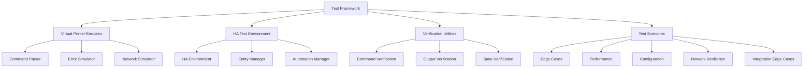

# ESCPOS Printer Integration Test Plan Summary

## Overview

This document provides a comprehensive summary of the test plan for the Home Assistant ESCPOS Thermal Printer integration. It outlines the test scenarios, implementation approach, and roadmap for creating a robust test suite that validates the integration's functionality, reliability, and performance.

## Test Scope

The test plan covers five key testing areas:

1. **Edge Cases & Boundary Testing** - Testing boundary conditions, special characters, and parameter limits
2. **Performance & Load Testing** - Testing concurrency, throughput, and resource usage
3. **Configuration Validation** - Testing configuration options and validation
4. **Network Resilience** - Testing behavior under various network conditions
5. **Home Assistant Integration Edge Cases** - Testing complex interactions with Home Assistant

## Test Scenarios Summary

### 1. Edge Cases & Boundary Testing (`test_edge_cases.py`)

Tests that focus on boundary conditions and edge cases:

- **Text Boundary Tests**: Tests with large content, long lines, empty text
- **Special Character Tests**: Tests with Unicode, special characters, and different encodings
- **Parameter Boundary Tests**: Tests with min/max values and invalid combinations
- **Command Malformation Tests**: Tests with malformed ESC/POS commands
- **Buffer Handling Tests**: Tests with buffer overflow and memory exhaustion

### 2. Performance & Load Testing (`test_performance.py`)

Tests that focus on performance under load:

- **Concurrency Tests**: Tests with parallel printing operations
- **High-Frequency Tests**: Tests with rapid sequential prints
- **Resource Monitoring Tests**: Tests that monitor memory usage and response time
- **Batch Operation Tests**: Tests with large batches and complex sequences
- **Cleanup Verification Tests**: Tests for connection cleanup and error recovery

### 3. Configuration Validation (`test_configuration.py`)

Tests that focus on configuration options:

- **Network Configuration Tests**: Tests with various hosts and non-standard ports
- **Timeout Configuration Tests**: Tests with various timeouts and timeout behavior
- **Encoding Configuration Tests**: Tests with different codepages and character encoding
- **Printer Model-Specific Tests**: Tests for Epson and Rongta printer features
- **Default Setting Tests**: Tests for alignment, cut type, and parameter fallbacks

### 4. Network Resilience Testing (`test_network_resilience.py`)

Tests that focus on network resilience:

- **Connection Drop Tests**: Tests with connection loss during print operations
- **Latency Tests**: Tests with high network latency and jitter
- **Packet Tests**: Tests with packet fragmentation, loss, and corruption
- **Network Barrier Tests**: Tests with firewalls, proxies, and connection limits
- **Name Resolution Tests**: Tests with DNS resolution failures and hostname/IP differences

### 5. Integration Edge Cases (`test_integration_edge_cases.py`)

Tests that focus on Home Assistant integration:

- **Service Interaction Tests**: Tests with concurrent service calls and service interactions
- **Event Handling Tests**: Tests with event-triggered printing and state tracking
- **Automation Tests**: Tests with complex automation chains and conditions
- **Integration Lifecycle Tests**: Tests for startup, shutdown, and configuration reload
- **Entity Interaction Tests**: Tests with template rendering and entity state interactions

## Implementation Architecture

## Required Enhancements

To implement the test plan, several enhancements to the existing test framework are required:

1. **Virtual Printer Emulator Enhancements**
   - Network simulation layer for testing network resilience
   - Enhanced command parsing for validating ESC/POS commands
   - State management for tracking printer status
   - Error simulation for testing error handling

2. **Home Assistant Test Environment Enhancements**
   - Entity management for creating and managing test entities
   - Automation and script support for testing complex scenarios
   - Service and event handling for testing integration points
   - Template rendering support for testing content templates

3. **Verification Utilities Enhancements**
   - Command verification for validating printer commands
   - Output verification for validating printed content
   - State verification for validating system state
   - Performance measurement for validating performance requirements

## Implementation Strategy

The implementation is divided into phases to progressively build the test framework:

### Phase 1: Foundation (Weeks 1-2)
- Implement core utility enhancements
- Enhance virtual printer emulator
- Enhance Home Assistant test environment

### Phase 2: Basic Tests (Weeks 3-4)
- Implement edge case tests
- Implement configuration validation tests
- Start network resilience test foundation
- Start performance test foundation

### Phase 3: Advanced Tests (Weeks 5-6)
- Complete network resilience tests
- Complete performance tests
- Implement integration edge case tests

### Phase 4: Finalization (Week 7)
- Complete test documentation
- Refine test implementations
- Final review and adjustments

## Priority Order

1. **Foundation Utilities** (Critical Priority)
   - Virtual printer enhancements
   - HA environment setup improvements
   - Verification utilities

2. **Basic Functionality Tests** (High Priority)
   - Edge cases tests
   - Configuration validation tests

3. **Advanced Tests** (Medium Priority)
   - Network resilience tests
   - Performance and load tests

4. **Integration Tests** (Medium Priority)
   - HA integration edge cases
   - Automation interaction tests

## Test Development Guidelines

1. **Test Isolation**
   - Each test must be isolated from others
   - Clean up resources after each test
   - Avoid test interdependencies

2. **Explicit Test Steps**
   - Make test steps clear and explicit
   - Use helper functions for common operations
   - Add comments explaining test logic

3. **Comprehensive Assertions**
   - Use specific assertions that explain failures
   - Check both positive and negative conditions
   - Verify side effects and state changes

4. **Asynchronous Testing**
   - Handle async operations properly
   - Account for timing and race conditions
   - Use proper async patterns in pytest

5. **Realistic Emulation**
   - Virtual printer must accurately emulate real printer behavior
   - Network simulation must model real-world conditions
   - HA integration must match production behavior

## Key Challenges

1. **Asynchronous Testing**
   - Managing async operations and timing
   - Handling race conditions
   - Ensuring test stability

2. **Realistic Emulation**
   - Accurately simulating printer behavior
   - Modeling network conditions
   - Replicating real-world usage patterns

3. **Test Coverage**
   - Covering all edge cases and boundary conditions
   - Testing integration points thoroughly
   - Ensuring comprehensive validation

4. **Maintainability**
   - Keeping tests readable and maintainable
   - Avoiding test brittleness
   - Documenting test scenarios properly

## Deliverables

1. **Test Scenario Documentation**
   - Detailed test scenario descriptions
   - Test case specifications
   - Edge case documentation

2. **Test Implementation**
   - Implemented test cases
   - Test fixtures and utilities
   - Verification helpers

3. **Implementation Documentation**
   - Implementation approach documentation
   - Utility enhancement documentation
   - Test development guidelines

4. **Test Results and Analysis**
   - Test execution results
   - Coverage analysis
   - Recommendations for integration improvements

## Next Steps

1. **Review and Approval**
   - Review test plan with stakeholders
   - Get approval for implementation approach
   - Finalize test scenarios

2. **Implementation Kickoff**
   - Set up development environment
   - Implement foundation utilities
   - Begin test implementation

3. **Progressive Implementation**
   - Implement tests in priority order
   - Review and refine as implementation progresses
   - Validate test coverage

## Conclusion

This test plan provides a comprehensive approach for validating the Home Assistant ESCPOS Thermal Printer integration. By implementing the test scenarios and following the implementation approach, the integration will be thoroughly tested for functionality, reliability, and performance.

The test plan emphasizes realistic testing scenarios, comprehensive edge case coverage, and thorough integration testing. By following the implementation roadmap and development guidelines, the test suite will provide ongoing value for maintaining and enhancing the integration.
