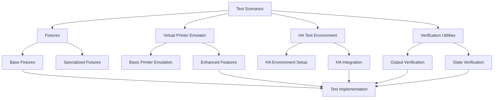
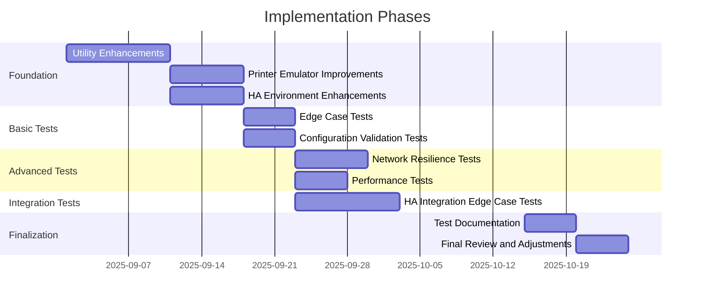

# ESCPOS Printer Integration Test Implementation Approach

## Overview

This document outlines the approach for implementing the advanced test scenarios designed for the Home Assistant ESCPOS Thermal Printer integration. The implementation covers five key testing areas:

1. **Edge Cases & Boundary Testing** (`test_edge_cases.py`)
2. **Performance & Load Testing** (`test_performance.py`)
3. **Configuration Validation** (`test_configuration.py`)
4. **Network Resilience Testing** (`test_network_resilience.py`)
5. **Integration Edge Cases** (`test_integration_edge_cases.py`)

## Implementation Framework

### Test Architecture



### Key Components

1. **Test Framework Structure**
   - All tests follow pytest's standard structure
   - Shared fixtures and utilities to minimize code duplication
   - Clear separation between test setup, execution, and verification

2. **Virtual Printer Emulator**
   - TCP socket-based printer emulator
   - Command parsing and execution
   - State tracking
   - Error simulation
   - Network condition simulation

3. **Home Assistant Test Environment**
   - Integration configuration and setup
   - Entity creation and management
   - Service registration and execution
   - Event handling and automation support

4. **Verification Utilities**
   - Command verification (ensuring commands were properly sent)
   - Output verification (validating printed content)
   - State verification (checking printer and HA states)
   - Error handling verification

## Required Utility Enhancements

### Virtual Printer Emulator Enhancements

1. **Network Simulation Layer**
   - Add capability to simulate network conditions:
     - Connection drops (disconnect/reconnect)
     - Latency and jitter
     - Packet loss and corruption
     - Packet reordering
     - Bandwidth limitations

   ```python
   class NetworkSimulator:
       """Simulates various network conditions for testing resilience."""

       async def simulate_disconnect(self, duration=None):
           """Simulate network disconnect for specified duration."""
           # Implementation

       async def simulate_latency(self, latency_ms, jitter_ms=0):
           """Add latency and optional jitter to network connections."""
           # Implementation

       async def simulate_packet_loss(self, loss_percentage):
           """Simulate packet loss at the specified percentage."""
           # Implementation

       # Other methods for network condition simulation
   ```

2. **Enhanced Command Parsing**
   - Extend command parser to handle all ESC/POS commands
   - Add support for command verification and validation
   - Implement printer model-specific command handling

   ```python
   class CommandParser:
       """Enhanced parser for ESC/POS commands."""

       def parse_command(self, data):
           """Parse raw data into structured command objects."""
           # Implementation

       def verify_command_sequence(self, commands):
           """Verify a sequence of commands is valid."""
           # Implementation

       def get_command_string(self, command):
           """Convert command object to debug string representation."""
           # Implementation
   ```

3. **State Management**
   - Add comprehensive state tracking for printer
   - Implement state transitions and event triggers
   - Add support for simulating various printer states

   ```python
   class PrinterState:
       """Manages the state of the virtual printer."""

       def __init__(self):
           self.online = True
           self.paper_status = "ok"  # ok, low, empty
           self.error_state = None
           self.buffer_state = {
               "capacity": 8192,
               "used": 0
           }
           # Other state attributes

       def update(self, state_change):
           """Update printer state based on changes."""
           # Implementation

       def simulate_error(self, error_type):
           """Simulate a printer error of specified type."""
           # Implementation
   ```

### Home Assistant Test Environment Enhancements

1. **Entity Management**
   - Add support for creating and managing multiple entities
   - Implement state change handling and tracking
   - Add support for custom entity attributes

   ```python
   class HAEntityManager:
       """Manages test entities in Home Assistant environment."""

       async def create_entity(self, domain, entity_id, state, attributes=None):
           """Create an entity with the specified domain, ID, state, and attributes."""
           # Implementation

       async def update_entity(self, entity_id, state, attributes=None):
           """Update an existing entity's state and attributes."""
           # Implementation

       async def track_entity_changes(self, entity_id, callback):
           """Track changes to an entity and execute callback when changed."""
           # Implementation
   ```

2. **Automation and Script Support**
   - Add support for creating and managing automations
   - Implement trigger simulation and verification
   - Add support for automation testing patterns

   ```python
   class AutomationManager:
       """Manages test automations in Home Assistant environment."""

       async def create_automation(self, automation_config):
           """Create an automation from configuration."""
           # Implementation

       async def enable_automation(self, automation_id):
           """Enable a specific automation."""
           # Implementation

       async def disable_automation(self, automation_id):
           """Disable a specific automation."""
           # Implementation

       async def trigger_automation(self, automation_id):
           """Manually trigger an automation."""
           # Implementation
   ```

3. **Service and Event Handling**
   - Enhance service registration and call handling
   - Add support for event tracking and verification
   - Implement service call interception for testing

   ```python
   class ServiceManager:
       """Manages services in Home Assistant test environment."""

       async def register_service(self, domain, service, handler, schema=None):
           """Register a service with optional schema validation."""
           # Implementation

       async def track_service_calls(self, domain, service, callback):
           """Track calls to a specific service."""
           # Implementation

       async def verify_service_called(self, domain, service, data=None):
           """Verify a service was called with optional data match."""
           # Implementation
   ```

### Verification Utilities Enhancements

1. **Command Verification**
   - Add support for verifying command sequences
   - Implement command attribute checking
   - Add timing verification for command execution

   ```python
   class CommandVerifier:
       """Verifies command execution and attributes."""

       def verify_command_sequence(self, actual_commands, expected_pattern):
           """Verify a sequence of commands matches expected pattern."""
           # Implementation

       def verify_command_attributes(self, command, expected_attributes):
           """Verify a command has expected attributes."""
           # Implementation

       def verify_command_timing(self, commands, timing_constraints):
           """Verify commands executed within timing constraints."""
           # Implementation
   ```

2. **Output Verification**
   - Add support for verifying printed output content
   - Implement formatting verification
   - Add support for comparing expected vs. actual output

   ```python
   class OutputVerifier:
       """Verifies printer output content and formatting."""

       def verify_text_content(self, actual_output, expected_content):
           """Verify text content matches expected."""
           # Implementation

       def verify_formatting(self, commands, expected_formatting):
           """Verify text formatting (bold, underline, etc.)."""
           # Implementation

       def verify_image_output(self, commands, expected_image):
           """Verify image output matches expected."""
           # Implementation
   ```

3. **State Verification**
   - Add support for verifying printer state
   - Implement entity state verification
   - Add support for verifying state transitions

   ```python
   class StateVerifier:
       """Verifies state conditions and transitions."""

       def verify_printer_state(self, actual_state, expected_state):
           """Verify printer state matches expected."""
           # Implementation

       def verify_entity_state(self, hass, entity_id, expected_state):
           """Verify an entity's state matches expected."""
           # Implementation

       def verify_state_transition(self, state_history, expected_transitions):
           """Verify state transitions occurred as expected."""
           # Implementation
   ```

## Implementation Strategy and Priorities

### Implementation Phases



### Priority Order

1. **Foundation Utilities (Critical Priority)**
   - Virtual printer enhancements
   - HA environment setup improvements
   - Verification utilities

2. **Basic Functionality Tests (High Priority)**
   - Edge cases tests (parameter boundaries, text handling)
   - Configuration validation tests

3. **Advanced Tests (Medium Priority)**
   - Network resilience tests
   - Performance and load tests

4. **Integration Tests (Medium Priority)**
   - HA integration edge cases
   - Automation interaction tests

### Implementation Approach by Test File

#### 1. Edge Cases & Boundary Testing (`test_edge_cases.py`)

**Implementation Strategy:**
- Start with text boundary tests (simplest to implement)
- Progress to parameter boundary tests
- Then implement special character/Unicode tests
- Finally add buffer handling and command malformation tests

**Key Dependencies:**
- Enhanced virtual printer with buffer state tracking
- Character encoding support in command parser
- Basic verification utilities

#### 2. Configuration Validation (`test_configuration.py`)

**Implementation Strategy:**
- Begin with basic configuration tests (hosts, ports)
- Add timeout configuration tests
- Implement encoding configuration tests
- Finally add printer model-specific tests

**Key Dependencies:**
- HA integration setup and teardown support
- Configuration loading and validation utilities
- Multiple printer model emulation

#### 3. Network Resilience Testing (`test_network_resilience.py`)

**Implementation Strategy:**
- Start with basic connection drop tests
- Add latency tests
- Implement packet-level tests
- Finally add complex network scenario tests

**Key Dependencies:**
- Network simulation layer
- Connection state tracking
- Error recovery mechanisms

#### 4. Performance & Load Testing (`test_performance.py`)

**Implementation Strategy:**
- Begin with basic throughput tests
- Add concurrency tests
- Implement resource monitoring tests
- Finally add stress testing and recovery tests

**Key Dependencies:**
- Performance measurement utilities
- Concurrency control in virtual printer
- Resource usage monitoring

#### 5. Integration Edge Cases (`test_integration_edge_cases.py`)

**Implementation Strategy:**
- Start with service interaction tests
- Add event handling tests
- Implement automation tests
- Finally add lifecycle and entity interaction tests

**Key Dependencies:**
- HA automation support
- Event and service tracking
- Entity state management
- Template rendering support

## Development Guidelines

### Code Structure

```
tests/integration_tests/
├── emulator/
│   ├── __init__.py
│   ├── virtual_printer.py
│   ├── command_parser.py
│   ├── error_simulator.py
│   └── network_simulator.py  # New
├── ha_environment/
│   ├── __init__.py
│   ├── ha_test_environment.py
│   ├── entity_manager.py     # New
│   ├── automation_manager.py # New
│   └── service_manager.py    # New
├── fixtures/
│   ├── __init__.py
│   ├── conftest.py
│   ├── mock_data_generator.py
│   ├── verification_utils.py
│   └── state_verifier.py     # New
├── scenarios/
│   ├── test_basic_functionality.py
│   ├── test_error_handling.py
│   ├── test_automation_integration.py
│   ├── test_edge_cases.py          # New
│   ├── test_performance.py         # New
│   ├── test_configuration.py       # New
│   ├── test_network_resilience.py  # New
│   └── test_integration_edge_cases.py # New
└── README.md
```

### Testing Patterns

1. **Fixture-Based Test Setup**
   - Use fixtures for setup and teardown
   - Parameterize tests for multiple test cases
   - Use fixture composition for complex test scenarios

   ```python
   @pytest.fixture
   async def complex_test_scenario(printer_fixture, ha_environment, network_simulator):
       # Set up a complex test scenario
       # Combine multiple fixtures
       yield combined_test_environment
       # Clean up
   ```

2. **Explicit Test Steps**
   - Make test steps clear and explicit
   - Use helper functions for common operations
   - Add comments explaining test logic

   ```python
   async def test_something_complex(fixture):
       # Step 1: Set up initial conditions
       await setup_initial_conditions()

       # Step 2: Perform the test action
       result = await perform_test_action()

       # Step 3: Verify results
       assert verify_result(result)
   ```

3. **Comprehensive Assertions**
   - Use specific assertions that explain failures
   - Check both positive and negative conditions
   - Verify side effects and state changes

   ```python
   # Check for successful outcome
   assert result.success, f"Operation failed with error: {result.error}"

   # Check for correct result value
   assert result.value == expected_value, f"Expected {expected_value}, got {result.value}"

   # Check for side effects
   assert system_state.changed, "System state should have changed"
   ```

## Implementation Roadmap

### Phase 1: Utility Enhancements (2 weeks)

1. **Week 1: Core Enhancements**
   - Enhance virtual printer with state tracking
   - Add network simulation layer
   - Enhance command parser

2. **Week 2: HA Environment Enhancements**
   - Add entity management
   - Implement service tracking
   - Add automation support

### Phase 2: Basic Test Implementation (2 weeks)

1. **Week 3: Edge Cases and Configuration Tests**
   - Implement basic edge case tests
   - Implement configuration validation tests

2. **Week 4: Network and Performance Foundation**
   - Implement basic network resilience tests
   - Implement simple performance tests

### Phase 3: Advanced Test Implementation (2 weeks)

1. **Week 5: Advanced Network and Performance Tests**
   - Complete network resilience test suite
   - Complete performance test suite

2. **Week 6: Integration Edge Cases**
   - Implement service interaction tests
   - Implement event handling tests
   - Implement automation tests

### Phase 4: Finalization (1 week)

1. **Week 7: Documentation and Refinement**
   - Complete test documentation
   - Refine test implementations
   - Add final assertions and verifications

## Key Challenges and Considerations

1. **Asynchronous Testing**
   - Tests must handle async operations properly
   - Need to account for timing and race conditions
   - Consider using proper async patterns in pytest

2. **Test Isolation**
   - Each test must be isolated from others
   - Clean up resources after each test
   - Avoid test interdependencies

3. **Realistic Emulation**
   - Virtual printer must accurately emulate real printer behavior
   - Network simulation must model real-world conditions
   - HA integration must match production behavior

4. **Performance Considerations**
   - Tests should run efficiently
   - Avoid unnecessary waits and delays
   - Use parametrization to cover multiple cases efficiently

5. **Maintainability**
   - Keep tests readable and well-documented
   - Use consistent patterns across test files
   - Make failure messages clear and actionable

## Required Resources

1. **Development Environment**
   - Python 3.9+ with asyncio support
   - pytest and pytest-asyncio
   - Home Assistant test framework

2. **Testing Infrastructure**
   - Local development environment
   - Continuous integration support
   - Documentation tools

3. **Knowledge Requirements**
   - ESC/POS protocol understanding
   - Home Assistant integration patterns
   - Asynchronous programming in Python
   - Network programming concepts

## Next Steps

1. Begin implementing foundation utilities
2. Set up test scaffolding and basic fixtures
3. Implement first test cases for edge testing
4. Progressively enhance the test framework
5. Implement remaining test scenarios
