# Integration Edge Cases Testing Design (`test_integration_edge_cases.py`)

## File Structure Overview

```mermaid
flowchart TD
    A[test_integration_edge_cases.py] --> B[Fixtures]
    A --> C[Service Interaction Tests]
    A --> D[Event Handling Tests]
    A --> E[Automation Tests]
    A --> F[Integration Lifecycle Tests]
    A --> G[Entity Interaction Tests]

    B --> B1[complex_ha_env_fixture]
    B --> B2[complex_automation_fixture]
    B --> B3[multi_service_fixture]
    B --> B4[template_fixture]

    C --> C1[test_concurrent_service_calls]
    C --> C2[test_service_call_timeout]
    C --> C3[test_service_parameter_validation]
    C --> C4[test_multiple_service_interaction]

    D --> D1[test_printer_state_tracking]
    D --> D2[test_event_triggered_printing]
    D --> D3[test_state_dependent_printing]
    D --> D4[test_event_flood_handling]

    E --> E1[test_complex_automation_chain]
    E --> E2[test_template_conditional_printing]
    E --> E3[test_time_based_printing]
    E --> E4[test_multi_trigger_printing]

    F --> F1[test_integration_startup]
    F --> F2[test_integration_shutdown]
    F --> F3[test_integration_reload]
    F --> F4[test_recovery_after_failure]

    G --> G1[test_template_rendering]
    G --> G2[test_entity_state_in_content]
    G --> G3[test_multi_entity_template]
    G --> G4[test_service_data_from_event]
```



## Fixtures Design

### `complex_ha_env_fixture` Fixture

This fixture provides a Home Assistant environment with multiple entities, services, and integrations.

```python
@pytest.fixture
async def complex_ha_env(ha_test_environment):
    """Fixture providing a complex Home Assistant environment with multiple entities and services."""
    ha_env = ha_test_environment

    # Set up printer integration
    printer_config = {
        'host': '127.0.0.1',
        'port': 9100,
        'timeout': 5.0,
        'codepage': 'cp437'
    }

    # Set up virtual printer
    printer = await VirtualPrinter(host='127.0.0.1', port=9100).start()

    # Initialize integration
    await ha_env.initialize_integration(printer_config)

    # Create additional test entities
    await ha_env.hass.async_block_till_done()

    # Create a sensor entity
    ha_env.hass.states.async_set('sensor.temperature', '22.5', {
        'unit_of_measurement': '°C',
        'friendly_name': 'Temperature',
        'device_class': 'temperature'
    })

    # Create a switch entity
    ha_env.hass.states.async_set('switch.test_switch', 'off', {
        'friendly_name': 'Test Switch',
        'icon': 'mdi:light-switch'
    })

    # Create a binary sensor entity
    ha_env.hass.states.async_set('binary_sensor.door', 'on', {
        'friendly_name': 'Front Door',
        'device_class': 'door'
    })

    # Create a light entity
    ha_env.hass.states.async_set('light.living_room', 'on', {
        'friendly_name': 'Living Room Light',
        'brightness': 255
    })

    # Create a counter helper
    ha_env.hass.states.async_set('counter.print_counter', '0', {
        'friendly_name': 'Print Counter'
    })

    # Register a custom service for testing service interactions
    async def test_service_handler(call):
        """Test service handler that can interact with the printer."""
        service_data = call.data

        if 'print_text' in service_data and service_data.get('print_text') is True:
            await ha_env.hass.services.async_call(
                'escpos_printer',
                'print_text',
                {'text': f"Triggered by test service: {service_data.get('message', '')}"},
                blocking=True
            )

    ha_env.hass.services.async_register(
        'test', 'trigger_print', test_service_handler,
        schema=vol.Schema({
            vol.Optional('message'): str,
            vol.Optional('print_text', default=False): bool,
        })
    )

    await ha_env.hass.async_block_till_done()

    try:
        yield {
            'ha_env': ha_env,
            'printer': printer,
            'config': printer_config
        }
    finally:
        # Clean up
        await printer.stop()
```

### `complex_automation_fixture` Fixture

This fixture sets up complex automations for testing printer interactions.

```python
@pytest.fixture
async def complex_automation(complex_ha_env):
    """Fixture providing complex automations for testing printer interactions."""
    ha_env = complex_ha_env['ha_env']

    # Define a basic automation that triggers printing when a door opens
    door_automation = {
        'id': 'door_print_automation',
        'alias': 'Print when door opens',
        'trigger': {
            'platform': 'state',
            'entity_id': 'binary_sensor.door',
            'from': 'off',
            'to': 'on'
        },
        'action': {
            'service': 'escpos_printer.print_text',
            'data': {
                'text': 'Door opened!'
            }
        }
    }

    # Define a complex automation with multiple triggers and conditions
    complex_auto = {
        'id': 'complex_print_automation',
        'alias': 'Complex print automation',
        'trigger': [
            {
                'platform': 'state',
                'entity_id': 'sensor.temperature',
                'above': 25
            },
            {
                'platform': 'state',
                'entity_id': 'light.living_room',
                'to': 'on'
            }
        ],
        'condition': {
            'condition': 'and',
            'conditions': [
                {
                    'condition': 'state',
                    'entity_id': 'switch.test_switch',
                    'state': 'on'
                },
                {
                    'condition': 'template',
                    'value_template': "{{ states('sensor.temperature')|float > 20 }}"
                }
            ]
        },
        'action': [
            {
                'service': 'counter.increment',
                'target': {
                    'entity_id': 'counter.print_counter'
                }
            },
            {
                'service': 'escpos_printer.print_text',
                'data': {
                    'text': "{{ 'Temperature is ' + states('sensor.temperature') + '°C' }}"
                }
            }
        ]
    }

    # Define a time-based automation
    time_auto = {
        'id': 'time_print_automation',
        'alias': 'Time-based print automation',
        'trigger': {
            'platform': 'time_pattern',
            'minutes': '/1'  # Every minute for testing
        },
        'condition': {
            'condition': 'template',
            'value_template': "{{ states('counter.print_counter')|int < 5 }}"
        },
        'action': [
            {
                'service': 'escpos_printer.print_text',
                'data': {
                    'text': "Time-based print at {{ now().strftime('%H:%M:%S') }}"
                }
            },
            {
                'service': 'counter.increment',
                'target': {
                    'entity_id': 'counter.print_counter'
                }
            }
        ]
    }

    # Create the automations
    automations = [door_automation, complex_auto, time_auto]

    # Helper function to create automation entities
    async def setup_automation(automation_config):
        automation_id = automation_config['id']
        await ha_env.hass.services.async_call(
            'automation', 'turn_off',
            {'entity_id': f'automation.{automation_id}'}, blocking=True
        )

        # Create the automation
        await ha_env.hass.services.async_call(
            'automation', 'reload', {}, blocking=True
        )

        return automation_id

    # Set up all automations
    automation_ids = []
    for auto_config in automations:
        auto_id = await setup_automation(auto_config)
        automation_ids.append(auto_id)

    await ha_env.hass.async_block_till_done()

    yield {
        'ha_env': ha_env,
        'printer': complex_ha_env['printer'],
        'automation_ids': automation_ids
    }

    # Clean up automations
    for auto_id in automation_ids:
        await ha_env.hass.services.async_call(
            'automation', 'turn_off',
            {'entity_id': f'automation.{auto_id}'}, blocking=True
        )
```

### `multi_service_fixture` Fixture

This fixture provides an environment with multiple printer-related services.

```python
@pytest.fixture
async def multi_service(complex_ha_env):
    """Fixture providing an environment with multiple printer-related services."""
    ha_env = complex_ha_env['ha_env']
    printer = complex_ha_env['printer']

    # Register additional printer-related services for testing
    async def custom_print_handler(call):
        """Handler for custom print service."""
        await ha_env.hass.services.async_call(
            'escpos_printer',
            'print_text',
            {'text': call.data.get('message', 'Custom print')},
            blocking=True
        )

    async def multi_print_handler(call):
        """Handler that performs multiple print operations."""
        messages = call.data.get('messages', [])
        delay = call.data.get('delay', 0)

        for msg in messages:
            await ha_env.hass.services.async_call(
                'escpos_printer',
                'print_text',
                {'text': msg},
                blocking=True
            )

            if delay > 0:
                await asyncio.sleep(delay)

    async def error_print_handler(call):
        """Handler that may raise errors based on parameters."""
        should_fail = call.data.get('should_fail', False)

        if should_fail:
            raise HomeAssistantError("Intentional failure in error_print service")

        await ha_env.hass.services.async_call(
            'escpos_printer',
            'print_text',
            {'text': call.data.get('message', 'Error test print')},
            blocking=True
        )

    # Register the services
    ha_env.hass.services.async_register(
        'test', 'custom_print', custom_print_handler,
        schema=vol.Schema({
            vol.Optional('message', default='Custom print'): str,
        })
    )

    ha_env.hass.services.async_register(
        'test', 'multi_print', multi_print_handler,
        schema=vol.Schema({
            vol.Required('messages'): vol.All(list, [str]),
            vol.Optional('delay', default=0): vol.Coerce(float),
        })
    )

    ha_env.hass.services.async_register(
        'test', 'error_print', error_print_handler,
        schema=vol.Schema({
            vol.Optional('message', default='Error test print'): str,
            vol.Optional('should_fail', default=False): bool,
        })
    )

    await ha_env.hass.async_block_till_done()

    yield {
        'ha_env': ha_env,
        'printer': printer
    }
```

### `template_fixture` Fixture

This fixture provides templates and template-related utilities for testing.

```python
@pytest.fixture
async def template_fixture(complex_ha_env):
    """Fixture providing templates and template-related utilities for testing."""
    ha_env = complex_ha_env['ha_env']
    printer = complex_ha_env['printer']

    # Define a collection of templates for testing
    templates = {
        'simple': "Simple template test",
        'entity_state': "Temperature: {{ states('sensor.temperature') }}°C",
        'conditional': "Door is openDoor is closed",
        'multi_entity': "Temperature: {{ states('sensor.temperature') }}°C, Light: {{ states('light.living_room') }}",
        'complex': """
Status Report
------------
Temperature: {{ states('sensor.temperature') }}°C
Door: {{ 'Open' if states('binary_sensor.door') == 'on' else 'Closed' }}
Light: {{ 'On' if states('light.living_room') == 'on' else 'Off' }}
Switch: {{ 'On' if states('switch.test_switch') == 'on' else 'Off' }}
Print Count: {{ states('counter.print_counter') }}
""",
        'invalid': "{{ this_function_does_not_exist() }}"
    }

    # Helper function to render templates
    async def render_template(template_name):
        template_str = templates.get(template_name)
        if not template_str:
            return None

        template_obj = ha_env.hass.helpers.template.Template(template_str, ha_env.hass)
        return await template_obj.async_render()

    # Helper function to print using a template
    async def print_with_template(template_name):
        template_str = templates.get(template_name)
        if not template_str:
            return False

        try:
            await ha_env.hass.services.async_call(
                'escpos_printer',
                'print_text',
                {'text': template_str},
                blocking=True
            )
            return True
        except Exception:
            return False

    yield {
        'ha_env': ha_env,
        'printer': printer,
        'templates': templates,
        'render_template': render_template,
        'print_with_template': print_with_template
    }
```

## Test Cases Design

### Service Interaction Tests

```python
@pytest.mark.asyncio
async def test_concurrent_service_calls(multi_service):
    """Test concurrent service calls to the printer."""
    ha_env = multi_service['ha_env']
    printer = multi_service['printer']

    # Prepare multiple concurrent print tasks
    tasks = []
    for i in range(5):
        task = asyncio.create_task(
            ha_env.hass.services.async_call(
                'escpos_printer',
                'print_text',
                {'text': f'Concurrent print {i + 1}'},
                blocking=True
            )
        )
        tasks.append(task)

    # Run all tasks concurrently
    await asyncio.gather(*tasks)

    # Verify all prints were processed
    command_log = await printer.get_command_log()
    text_commands = [cmd for cmd in command_log if cmd.command_type == 'text']

    # Check that we have exactly 5 print commands
    assert len(text_commands) == 5

    # Check that all expected texts were printed
    printed_texts = [str(cmd) for cmd in text_commands]
    for i in range(5):
        assert any(f'Concurrent print {i + 1}' in text for text in printed_texts)

@pytest.mark.asyncio
async def test_service_call_timeout(multi_service):
    """Test service call timeout handling."""
    ha_env = multi_service['ha_env']
    printer = multi_service['printer']

    # Simulate a slow printer by adding delays to command processing
    await printer.set_command_delay(2.0)  # 2 second delay

    # Set a short timeout in the service call
    start_time = time.time()

    try:
        await ha_env.hass.services.async_call(
            'escpos_printer',
            'print_text',
            {
                'text': 'This should timeout',
                'timeout': 1.0  # 1 second timeout, shorter than the printer delay
            },
            blocking=True
        )
        timed_out = False
    except Exception as e:
        timed_out = "timeout" in str(e).lower()

    # Reset printer delay
    await printer.set_command_delay(0)

    # Verify the call timed out
    assert timed_out, "Service call should have timed out"

    # Verify the operation took approximately the timeout duration
    operation_time = time.time() - start_time
    assert operation_time < 1.5, "Timeout should have occurred after ~1 second"

    # Verify printer is still functional after timeout
    await ha_env.hass.services.async_call(
        'escpos_printer',
        'print_text',
        {'text': 'After timeout test'},
        blocking=True
    )

    # Verify the second print command was processed
    command_log = await printer.get_command_log()
    after_timeout_prints = [cmd for cmd in command_log
                           if cmd.command_type == 'text' and 'After timeout' in str(cmd)]
    assert len(after_timeout_prints) == 1

@pytest.mark.asyncio
@pytest.mark.parametrize("invalid_param, expected_error", [
    ({'text': None}, "text"),
    ({'text': '', 'invalid_param': 'value'}, "invalid_param"),
    ({'text': 'Valid', 'cut': 'invalid_cut_type'}, "cut"),
    ({'text': 'Valid', 'codepage': 'invalid_codepage'}, "codepage"),
])
async def test_service_parameter_validation(multi_service, invalid_param, expected_error):
    """Test validation of service parameters."""
    ha_env = multi_service['ha_env']

    # Attempt to call the service with invalid parameters
    try:
        await ha_env.hass.services.async_call(
            'escpos_printer',
            'print_text',
            invalid_param,
            blocking=True
        )
        validation_failed = False
    except Exception as e:
        # Check if the error message contains the expected parameter name
        validation_failed = expected_error.lower() in str(e).lower()

    # Verify the validation failed with the expected error
    assert validation_failed, f"Service call should have failed validation for {expected_error}"

@pytest.mark.asyncio
async def test_multiple_service_interaction(multi_service):
    """Test interaction between multiple services."""
    ha_env = multi_service['ha_env']
    printer = multi_service['printer']

    # Call the multi_print service which will trigger multiple print_text calls
    await ha_env.hass.services.async_call(
        'test',
        'multi_print',
        {
            'messages': [
                'Message 1',
                'Message 2',
                'Message 3'
            ],
            'delay': 0.1  # Small delay between prints
        },
        blocking=True
    )

    # Verify all three prints were processed
    command_log = await printer.get_command_log()
    text_commands = [cmd for cmd in command_log if cmd.command_type == 'text']
    assert len(text_commands) == 3

    # Verify they were processed in order
    printed_texts = [str(cmd) for cmd in text_commands]
    for i, text in enumerate(['Message 1', 'Message 2', 'Message 3']):
        assert text in printed_texts[i]

    # Now test error handling between services
    await ha_env.hass.services.async_call(
        'test',
        'error_print',
        {
            'message': 'This should not print',
            'should_fail': True
        },
        blocking=False  # Non-blocking to continue execution
    )

    await asyncio.sleep(0.5)  # Give some time for the error to propagate

    # The printer should still be functional
    await ha_env.hass.services.async_call(
        'escpos_printer',
        'print_text',
        {'text': 'After error test'},
        blocking=True
    )

    # Verify the 'After error test' print was processed
    command_log = await printer.get_command_log()
    after_error_prints = [cmd for cmd in command_log
                         if cmd.command_type == 'text' and 'After error test' in str(cmd)]
    assert len(after_error_prints) == 1
```

### Event Handling Tests

```python
@pytest.mark.asyncio
async def test_printer_state_tracking(complex_ha_env):
    """Test tracking of printer state in Home Assistant."""
    ha_env = complex_ha_env['ha_env']
    printer = complex_ha_env['printer']

    # Check initial printer state
    initial_state = ha_env.hass.states.get('escpos_printer.printer')
    assert initial_state is not None
    assert initial_state.state == 'online'

    # Simulate printer going offline
    await printer.simulate_error('offline')

    # Give time for state to update
    await asyncio.sleep(0.5)
    await ha_env.hass.async_block_till_done()

    # Check updated state
    offline_state = ha_env.hass.states.get('escpos_printer.printer')
    assert offline_state.state == 'offline'

    # Bring printer back online
    await printer.reset()

    # Give time for state to update
    await asyncio.sleep(0.5)
    await ha_env.hass.async_block_till_done()

    # Check state after recovery
    recovered_state = ha_env.hass.states.get('escpos_printer.printer')
    assert recovered_state.state == 'online'

    # Check attributes for diagnostic information
    assert 'last_error' in recovered_state.attributes

@pytest.mark.asyncio
async def test_event_triggered_printing(complex_ha_env):
    """Test printing triggered by Home Assistant events."""
    ha_env = complex_ha_env['ha_env']
    printer = complex_ha_env['printer']

    # Register an event listener that triggers printing
    async def event_listener(event):
        """Listen for test events and trigger printing."""
        event_data = event.data

        if 'print_message' in event_data:
            await ha_env.hass.services.async_call(
                'escpos_printer',
                'print_text',
                {'text': event_data['print_message']},
                blocking=True
            )

    # Register the listener for a test event
    ha_env.hass.bus.async_listen('test_print_event', event_listener)

    # Give time for listener to register
    await ha_env.hass.async_block_till_done()

    # Fire a test event
    ha_env.hass.bus.async_fire('test_print_event', {
        'print_message': 'Event triggered print'
    })

    # Give time for event processing and printing
    await asyncio.sleep(0.5)
    await ha_env.hass.async_block_till_done()

    # Verify the event triggered a print
    command_log = await printer.get_command_log()
    event_prints = [cmd for cmd in command_log
                   if cmd.command_type == 'text' and 'Event triggered print' in str(cmd)]
    assert len(event_prints) == 1

    # Fire multiple events in quick succession
    for i in range(5):
        ha_env.hass.bus.async_fire('test_print_event', {
            'print_message': f'Event {i+1}'
        })

    # Give time for all events to process
    await asyncio.sleep(1.0)
    await ha_env.hass.async_block_till_done()

    # Verify all events triggered prints
    command_log = await printer.get_command_log()
    event_prints = [cmd for cmd in command_log if cmd.command_type == 'text' and 'Event ' in str(cmd)]
    assert len(event_prints) == 5

@pytest.mark.asyncio
async def test_state_dependent_printing(complex_ha_env, template_fixture):
    """Test printing that depends on entity states."""
    ha_env = complex_ha_env['ha_env']
    printer = complex_ha_env['printer']
    print_with_template = template_fixture['print_with_template']

    # Set up initial states
    ha_env.hass.states.async_set('sensor.temperature', '22.5')
    ha_env.hass.states.async_set('binary_sensor.door', 'off')
    await ha_env.hass.async_block_till_done()

    # Print using a template that includes the states
    await print_with_template('multi_entity')

    # Change the states
    ha_env.hass.states.async_set('sensor.temperature', '25.0')
    ha_env.hass.states.async_set('binary_sensor.door', 'on')
    await ha_env.hass.async_block_till_done()

    # Print again with the new states
    await print_with_template('multi_entity')

    # Verify both prints occurred with different content
    command_log = await printer.get_command_log()
    text_commands = [cmd for cmd in command_log if cmd.command_type == 'text']
    assert len(text_commands) == 2

    # Check that the prints contain the different state values
    first_print = str(text_commands[0])
    second_print = str(text_commands[1])

    assert '22.5' in first_print
    assert '25.0' in second_print

@pytest.mark.asyncio
async def test_event_flood_handling(complex_ha_env):
    """Test handling of a flood of events that trigger printing."""
    ha_env = complex_ha_env['ha_env']
    printer = complex_ha_env['printer']

    # Register an event listener that triggers printing
    async def event_listener(event):
        """Listen for test events and trigger printing."""
        event_data = event.data

        if 'print_message' in event_data:
            try:
                await ha_env.hass.services.async_call(
                    'escpos_printer',
                    'print_text',
                    {'text': event_data['print_message']},
                    blocking=True
                )
            except Exception:
                # Ignore errors for this test
                pass

    # Register the listener
    remove_listener = ha_env.hass.bus.async_listen('flood_test_event', event_listener)

    # Give time for listener to register
    await ha_env.hass.async_block_till_done()

    # Fire many events in rapid succession (flood)
    event_count = 20
    for i in range(event_count):
        ha_env.hass.bus.async_fire('flood_test_event', {
            'print_message': f'Flood event {i+1}'
        })

    # Give time for events to be processed
    await asyncio.sleep(2.0)
    await ha_env.hass.async_block_till_done()

    # Clean up the listener
    remove_listener()

    # Verify that the events were handled (though some might have been dropped or failed)
    command_log = await printer.get_command_log()
    flood_prints = [cmd for cmd in command_log
                   if cmd.command_type == 'text' and 'Flood event' in str(cmd)]

    # Note: We don't expect exactly event_count prints due to potential
    # rate limiting, dropped events, or service call failures under load
    assert len(flood_prints) > 0

    # Verify the printer is still functional after the flood
    await ha_env.hass.services.async_call(
        'escpos_printer',
        'print_text',
        {'text': 'After flood test'},
        blocking=True
    )

    # Verify the final print was successful
    command_log = await printer.get_command_log()
    after_flood_prints = [cmd for cmd in command_log
                         if cmd.command_type == 'text' and 'After flood test' in str(cmd)]
    assert len(after_flood_prints) == 1
```

### Automation Tests

```python
@pytest.mark.asyncio
async def test_complex_automation_chain(complex_automation):
    """Test complex automation chains involving the printer."""
    ha_env = complex_automation['ha_env']
    printer = complex_automation['printer']

    # Enable the complex automation
    await ha_env.hass.services.async_call(
        'automation', 'turn_on',
        {'entity_id': 'automation.complex_print_automation'},
        blocking=True
    )

    # Set up conditions to trigger the automation
    # First set the switch to on (to meet the condition)
    ha_env.hass.states.async_set('switch.test_switch', 'on')

    # Then update the temperature to trigger the automation
    ha_env.hass.states.async_set('sensor.temperature', '26.0')

    # Give time for automation to process
    await asyncio.sleep(0.5)
    await ha_env.hass.async_block_till_done()

    # Verify the print occurred
    command_log = await printer.get_command_log()
    temp_prints = [cmd for cmd in command_log
                  if cmd.command_type == 'text' and '26.0' in str(cmd)]
    assert len(temp_prints) == 1

    # Verify the counter was incremented
    counter_state = ha_env.hass.states.get('counter.print_counter')
    assert counter_state.state == '1'

    # Now trigger the automation with the light
    ha_env.hass.states.async_set('light.living_room', 'off')
    await asyncio.sleep(0.1)
    ha_env.hass.states.async_set('light.living_room', 'on')

    # Give time for automation to process
    await asyncio.sleep(0.5)
    await ha_env.hass.async_block_till_done()

    # Verify another print occurred and counter increased again
    command_log = await printer.get_command_log()
    text_commands = [cmd for cmd in command_log if cmd.command_type == 'text']
    assert len(text_commands) == 2

    counter_state = ha_env.hass.states.get('counter.print_counter')
    assert counter_state.state == '2'

@pytest.mark.asyncio
async def test_template_conditional_printing(complex_automation, template_fixture):
    """Test conditional printing based on templates in automations."""
    ha_env = complex_automation['ha_env']
    printer = complex_automation['printer']

    # Create a template-based automation
    template_auto = {
        'id': 'template_print_automation',
        'alias': 'Template print automation',
        'trigger': {
            'platform': 'state',
            'entity_id': 'sensor.temperature'
        },
        'condition': {
            'condition': 'template',
            'value_template': "{{ trigger.to_state.state|float > trigger.from_state.state|float }}"
        },
        'action': {
            'service': 'escpos_printer.print_text',
            'data': {
                'text': "Temperature increased to {{ trigger.to_state.state }}°C from {{ trigger.from_state.state }}°C"
            }
        }
    }

    # Create the automation
    automation_id = template_auto['id']

    # Set up automation
    await ha_env.hass.services.async_call(
        'automation', 'turn_off',
        {'entity_id': f'automation.{automation_id}'}, blocking=True
    )

    # Reload automations to include our new one
    await ha_env.hass.services.async_call(
        'automation', 'reload', {}, blocking=True
    )

    # Enable the automation
    await ha_env.hass.services.async_call(
        'automation', 'turn_on',
        {'entity_id': f'automation.{automation_id}'},
        blocking=True
    )

    await ha_env.hass.async_block_till_done()

    # Set an initial temperature
    ha_env.hass.states.async_set('sensor.temperature', '22.0')
    await asyncio.sleep(0.1)
    await ha_env.hass.async_block_till_done()

    # Trigger by increasing temperature
    ha_env.hass.states.async_set('sensor.temperature', '23.0')
    await asyncio.sleep(0.5)
    await ha_env.hass.async_block_till_done()

    # Verify the print occurred
    command_log = await printer.get_command_log()
    increase_prints = [cmd for cmd in command_log
                      if cmd.command_type == 'text' and 'increased' in str(cmd)]
    assert len(increase_prints) == 1
    assert '22.0' in str(increase_prints[0])
    assert '23.0' in str(increase_prints[0])

    # Now decrease the temperature (should not trigger print)
    ha_env.hass.states.async_set('sensor.temperature', '21.0')
    await asyncio.sleep(0.5)
    await ha_env.hass.async_block_till_done()

    # Verify no new print occurred
    command_log = await printer.get_command_log()
    text_commands = [cmd for cmd in command_log if cmd.command_type == 'text']
    assert len(text_commands) == 1  # Still just the one from before

@pytest.mark.asyncio
async def test_time_based_printing(complex_automation):
    """Test time-based automation printing."""
    ha_env = complex_automation['ha_env']
    printer = complex_automation['printer']

    # Enable the time-based automation
    await ha_env.hass.services.async_call(
        'automation', 'turn_on',
        {'entity_id': 'automation.time_print_automation'},
        blocking=True
    )

    # Reset the counter to ensure the condition is met
    await ha_env.hass.services.async_call(
        'counter', 'reset',
        {'entity_id': 'counter.print_counter'},
        blocking=True
    )

    # Manually trigger the time pattern automation
    await ha_env.hass.services.async_call(
        'automation', 'trigger',
        {'entity_id': 'automation.time_print_automation'},
        blocking=True
    )

    # Give time for automation to process
    await asyncio.sleep(0.5)
    await ha_env.hass.async_block_till_done()

    # Verify the print occurred
    command_log = await printer.get_command_log()
    time_prints = [cmd for cmd in command_log
                  if cmd.command_type == 'text' and 'Time-based print' in str(cmd)]
    assert len(time_prints) == 1

    # Verify the counter was incremented
    counter_state = ha_env.hass.states.get('counter.print_counter')
    assert counter_state.state == '1'

    # Trigger again multiple times to test the counter limit condition
    for _ in range(5):
        await ha_env.hass.services.async_call(
            'automation', 'trigger',
            {'entity_id': 'automation.time_print_automation'},
            blocking=True
        )
        await asyncio.sleep(0.2)

    await ha_env.hass.async_block_till_done()

    # Verify we got exactly 4 more prints (for a total of 5)
    command_log = await printer.get_command_log()
    time_prints = [cmd for cmd in command_log
                  if cmd.command_type == 'text' and 'Time-based print' in str(cmd)]
    assert len(time_prints) == 5

    # Verify the counter reached 5
    counter_state = ha_env.hass.states.get('counter.print_counter')
    assert counter_state.state == '5'

    # One more trigger should not cause a print due to the counter condition
    await ha_env.hass.services.async_call(
        'automation', 'trigger',
        {'entity_id': 'automation.time_print_automation'},
        blocking=True
    )

    await asyncio.sleep(0.5)
    await ha_env.hass.async_block_till_done()

    # Verify no additional prints occurred
    command_log = await printer.get_command_log()
    time_prints = [cmd for cmd in command_log
                  if cmd.command_type == 'text' and 'Time-based print' in str(cmd)]
    assert len(time_prints) == 5  # Still just 5

@pytest.mark.asyncio
async def test_multi_trigger_printing(complex_automation):
    """Test printing with multiple trigger types."""
    ha_env = complex_automation['ha_env']
    printer = complex_automation['printer']

    # Create an automation with multiple trigger types
    multi_trigger_auto = {
        'id': 'multi_trigger_automation',
        'alias': 'Multi-trigger print automation',
        'trigger': [
            {
                'platform': 'state',
                'entity_id': 'binary_sensor.door'
            },
            {
                'platform': 'numeric_state',
                'entity_id': 'sensor.temperature',
                'above': 24
            },
            {
                'platform': 'event',
                'event_type': 'multi_trigger_test'
            }
        ],
        'action': {
            'service': 'escpos_printer.print_text',
            'data': {
                'text': "Triggered by {{ trigger.platform }}: {{ trigger.to_state.state if trigger.platform == 'state' else trigger.event.event_type if trigger.platform == 'event' else trigger.to_state.state }}"
            }
        }
    }

    # Set up automation
    automation_id = multi_trigger_auto['id']
    await ha_env.hass.services.async_call(
        'automation', 'turn_off',
        {'entity_id': f'automation.{automation_id}'}, blocking=True
    )

    # Reload automations
    await ha_env.hass.services.async_call(
        'automation', 'reload', {}, blocking=True
    )

    # Enable the automation
    await ha_env.hass.services.async_call(
        'automation', 'turn_on',
        {'entity_id': f'automation.{automation_id}'},
        blocking=True
    )

    await ha_env.hass.async_block_till_done()

    # Trigger with state change
    ha_env.hass.states.async_set('binary_sensor.door', 'off')
    await asyncio.sleep(0.1)
    ha_env.hass.states.async_set('binary_sensor.door', 'on')

    await asyncio.sleep(0.5)
    await ha_env.hass.async_block_till_done()

    # Trigger with numeric state
    ha_env.hass.states.async_set('sensor.temperature', '25.0')

    await asyncio.sleep(0.5)
    await ha_env.hass.async_block_till_done()

    # Trigger with event
    ha_env.hass.bus.async_fire('multi_trigger_test')

    await asyncio.sleep(0.5)
    await ha_env.hass.async_block_till_done()

    # Verify all three triggers caused prints
    command_log = await printer.get_command_log()
    trigger_prints = [cmd for cmd in command_log
                     if cmd.command_type == 'text' and 'Triggered by' in str(cmd)]

    assert len(trigger_prints) == 3

    # Verify each trigger type is represented
    trigger_texts = [str(cmd) for cmd in trigger_prints]
    assert any('Triggered by state' in text for text in trigger_texts)
    assert any('Triggered by numeric_state' in text for text in trigger_texts)
    assert any('Triggered by event' in text for text in trigger_texts)
```

### Integration Lifecycle Tests

```python
@pytest.mark.asyncio
async def test_integration_startup(complex_ha_env):
    """Test printer integration behavior during startup."""
    # We'll simulate startup by removing and re-adding the integration
    ha_env = complex_ha_env['ha_env']
    printer = complex_ha_env['printer']
    config = complex_ha_env['config']

    # Remove the integration
    await ha_env.remove_integration()

    # Verify the printer entity is removed
    assert ha_env.hass.states.get('escpos_printer.printer') is None

    # Now initialize the integration again (simulating startup)
    await ha_env.initialize_integration(config)

    # Verify the printer entity is created
    assert ha_env.hass.states.get('escpos_printer.printer') is not None

    # Verify printing works after startup
    await ha_env.hass.services.async_call(
        'escpos_printer',
        'print_text',
        {'text': 'After startup test'},
        blocking=True
    )

    # Verify the print command was processed
    command_log = await printer.get_command_log()
    startup_prints = [cmd for cmd in command_log
                     if cmd.command_type == 'text' and 'After startup test' in str(cmd)]
    assert len(startup_prints) == 1

@pytest.mark.asyncio
async def test_integration_shutdown(complex_ha_env):
    """Test printer integration behavior during shutdown."""
    ha_env = complex_ha_env['ha_env']
    printer = complex_ha_env['printer']

    # First, make a normal print
    await ha_env.hass.services.async_call(
        'escpos_printer',
        'print_text',
        {'text': 'Before shutdown test'},
        blocking=True
    )

    # Start a long print operation that will be interrupted by shutdown
    print_task = asyncio.create_task(
        ha_env.hass.services.async_call(
            'escpos_printer',
            'print_text',
            {'text': 'X' * 10000},  # Large print that will take time
            blocking=True
        )
    )

    # Give the print task time to start
    await asyncio.sleep(0.2)

    # Simulate shutdown by removing the integration
    await ha_env.remove_integration()

    # Wait a bit for the operation to be cancelled
    await asyncio.sleep(0.5)

    # Verify the entity is removed during shutdown
    assert ha_env.hass.states.get('escpos_printer.printer') is None

    # Try to cancel the print task if it's still running
    if not print_task.done():
        print_task.cancel()
        try:
            await print_task
        except asyncio.CancelledError:
            pass

    # Verify the initial print was successful
    command_log = await printer.get_command_log()
    before_shutdown_prints = [cmd for cmd in command_log
                             if cmd.command_type == 'text' and 'Before shutdown test' in str(cmd)]
    assert len(before_shutdown_prints) == 1

@pytest.mark.asyncio
async def test_integration_reload(complex_ha_env):
    """Test printer integration behavior during config reload."""
    ha_env = complex_ha_env['ha_env']
    printer = complex_ha_env['printer']

    # Initial print to verify functionality
    await ha_env.hass.services.async_call(
        'escpos_printer',
        'print_text',
        {'text': 'Before reload test'},
        blocking=True
    )

    # Save the initial entity ID
    initial_entity_id = 'escpos_printer.printer'
    initial_entity = ha_env.hass.states.get(initial_entity_id)
    assert initial_entity is not None

    # Simulate a config reload with modified configuration
    new_config = {
        'host': '127.0.0.1',
        'port': 9100,
        'timeout': 10.0,  # Changed from 5.0
        'codepage': 'cp850',  # Changed from cp437
        'name': 'Reloaded Printer'  # Changed name
    }

    # Remove and recreate with new config
    await ha_env.remove_integration()
    await ha_env.initialize_integration(new_config)

    # Verify the entity exists with the new name
    reloaded_entity = ha_env.hass.states.get('escpos_printer.reloaded_printer')
    assert reloaded_entity is not None

    # Verify printing works after reload
    await ha_env.hass.services.async_call(
        'escpos_printer',
        'print_text',
        {'text': 'After reload test'},
        blocking=True
    )

    # Verify both prints were processed
    command_log = await printer.get_command_log()
    before_prints = [cmd for cmd in command_log
                    if cmd.command_type == 'text' and 'Before reload test' in str(cmd)]
    after_prints = [cmd for cmd in command_log
                   if cmd.command_type == 'text' and 'After reload test' in str(cmd)]

    assert len(before_prints) == 1
    assert len(after_prints) == 1

    # Verify the new configuration was applied
    # This could be checked by looking at printer commands that use codepage
    # or by examining the entity attributes

@pytest.mark.asyncio
async def test_recovery_after_failure(complex_ha_env):
    """Test printer integration recovery after failure."""
    ha_env = complex_ha_env['ha_env']
    printer = complex_ha_env['printer']

    # Initial print to verify functionality
    await ha_env.hass.services.async_call(
        'escpos_printer',
        'print_text',
        {'text': 'Before failure test'},
        blocking=True
    )

    # Simulate a critical printer failure
    await printer.simulate_error('critical_error')

    # Try to print during failure (should fail)
    try:
        await ha_env.hass.services.async_call(
            'escpos_printer',
            'print_text',
            {'text': 'During failure test'},
            blocking=True
        )
        print_succeeded = True
    except Exception:
        print_succeeded = False

    # Print should have failed
    assert not print_succeeded

    # Verify printer state shows an error
    error_state = ha_env.hass.states.get('escpos_printer.printer')
    assert error_state.state == 'error'
    assert 'last_error' in error_state.attributes

    # Reset the printer
    await printer.reset()

    # Give time for recovery to be detected
    await asyncio.sleep(0.5)
    await ha_env.hass.async_block_till_done()

    # Verify state has recovered
    recovered_state = ha_env.hass.states.get('escpos_printer.printer')
    assert recovered_state.state == 'online'

    # Try printing again after recovery
    await ha_env.hass.services.async_call(
        'escpos_printer',
        'print_text',
        {'text': 'After recovery test'},
        blocking=True
    )

    # Verify the first and third prints succeeded
    command_log = await printer.get_command_log()
    before_prints = [cmd for cmd in command_log
                    if cmd.command_type == 'text' and 'Before failure test' in str(cmd)]
    during_prints = [cmd for cmd in command_log
                    if cmd.command_type == 'text' and 'During failure test' in str(cmd)]
    after_prints = [cmd for cmd in command_log
                   if cmd.command_type == 'text' and 'After recovery test' in str(cmd)]

    assert len(before_prints) == 1
    assert len(during_prints) == 0  # Should not have printed during failure
    assert len(after_prints) == 1
```

### Entity Interaction Tests

```python
@pytest.mark.asyncio
async def test_template_rendering(template_fixture):
    """Test template rendering in print content."""
    ha_env = template_fixture['ha_env']
    printer = template_fixture['printer']
    templates = template_fixture['templates']
    print_with_template = template_fixture['print_with_template']

    # Set up entity states for template rendering
    ha_env.hass.states.async_set('sensor.temperature', '22.5')
    ha_env.hass.states.async_set('binary_sensor.door', 'on')
    ha_env.hass.states.async_set('light.living_room', 'on')
    ha_env.hass.states.async_set('switch.test_switch', 'off')

    await ha_env.hass.async_block_till_done()

    # Test simple template
    await print_with_template('simple')

    # Test entity state template
    await print_with_template('entity_state')

    # Test conditional template
    await print_with_template('conditional')

    # Test complex template
    await print_with_template('complex')

    # Verify all templates were rendered and printed
    command_log = await printer.get_command_log()
    text_commands = [cmd for cmd in command_log if cmd.command_type == 'text']
    assert len(text_commands) == 4

    printed_texts = [str(cmd) for cmd in text_commands]

    # Verify entity state was included
    assert any('22.5' in text for text in printed_texts)

    # Verify conditional logic worked
    assert any('Door is open' in text for text in printed_texts)

    # Verify the complex template with multiple entities
    complex_prints = [text for text in printed_texts if 'Status Report' in text]
    assert len(complex_prints) == 1
    assert 'Temperature: 22.5' in complex_prints[0]
    assert 'Door: Open' in complex_prints[0]
    assert 'Light: On' in complex_prints[0]
    assert 'Switch: Off' in complex_prints[0]

    # Test error handling with invalid template
    try:
        await print_with_template('invalid')
        template_error_handled = True
    except Exception:
        template_error_handled = False

    # Expect the template error to be handled
    assert template_error_handled

@pytest.mark.asyncio
async def test_entity_state_in_content(complex_ha_env):
    """Test using entity states in print content."""
    ha_env = complex_ha_env['ha_env']
    printer = complex_ha_env['printer']

    # Set entity states
    ha_env.hass.states.async_set('sensor.temperature', '22.5')
    ha_env.hass.states.async_set('binary_sensor.door', 'on')

    await ha_env.hass.async_block_till_done()

    # Print with template that includes entity states
    await ha_env.hass.services.async_call(
        'escpos_printer',
        'print_text',
        {
            'text': "Temperature is {{ states('sensor.temperature') }}°C and the door is {{ 'open' if states('binary_sensor.door') == 'on' else 'closed' }}"
        },
        blocking=True
    )

    # Change states
    ha_env.hass.states.async_set('sensor.temperature', '23.5')
    ha_env.hass.states.async_set('binary_sensor.door', 'off')

    await ha_env.hass.async_block_till_done()

    # Print again with the new states
    await ha_env.hass.services.async_call(
        'escpos_printer',
        'print_text',
        {
            'text': "Temperature is {{ states('sensor.temperature') }}°C and the door is {{ 'open' if states('binary_sensor.door') == 'on' else 'closed' }}"
        },
        blocking=True
    )

    # Verify both prints with different state values
    command_log = await printer.get_command_log()
    text_commands = [cmd for cmd in command_log if cmd.command_type == 'text']
    assert len(text_commands) == 2

    first_print = str(text_commands[0])
    second_print = str(text_commands[1])

    assert '22.5' in first_print
    assert 'door is open' in first_print
    assert '23.5' in second_print
    assert 'door is closed' in second_print

@pytest.mark.asyncio
async def test_multi_entity_template(template_fixture):
    """Test templates with multiple entity references."""
    ha_env = template_fixture['ha_env']
    printer = template_fixture['printer']

    # Set up multiple entities with different values
    ha_env.hass.states.async_set('sensor.temperature', '22.5')
    ha_env.hass.states.async_set('sensor.humidity', '45')
    ha_env.hass.states.async_set('sensor.pressure', '1013')
    ha_env.hass.states.async_set('weather.home', 'sunny')

    await ha_env.hass.async_block_till_done()

    # Create a template that references multiple entities
    multi_entity_template = """
Weather Report
-------------
Temperature: {{ states('sensor.temperature') }}°C
Humidity: {{ states('sensor.humidity') }}%
Pressure: {{ states('sensor.pressure') }} hPa
Condition: {{ states('weather.home') }}
"""

    # Print with the multi-entity template
    await ha_env.hass.services.async_call(
        'escpos_printer',
        'print_text',
        {'text': multi_entity_template},
        blocking=True
    )

    # Change all entity states
    ha_env.hass.states.async_set('sensor.temperature', '18.0')
    ha_env.hass.states.async_set('sensor.humidity', '65')
    ha_env.hass.states.async_set('sensor.pressure', '1005')
    ha_env.hass.states.async_set('weather.home', 'rainy')

    await ha_env.hass.async_block_till_done()

    # Print again with the updated states
    await ha_env.hass.services.async_call(
        'escpos_printer',
        'print_text',
        {'text': multi_entity_template},
        blocking=True
    )

    # Verify both prints with all entity values
    command_log = await printer.get_command_log()
    text_commands = [cmd for cmd in command_log if cmd.command_type == 'text']
    assert len(text_commands) == 2

    first_print = str(text_commands[0])
    second_print = str(text_commands[1])

    # Check first print has original values
    assert 'Temperature: 22.5°C' in first_print
    assert 'Humidity: 45%' in first_print
    assert 'Pressure: 1013 hPa' in first_print
    assert 'Condition: sunny' in first_print

    # Check second print has updated values
    assert 'Temperature: 18.0°C' in second_print
    assert 'Humidity: 65%' in second_print
    assert 'Pressure: 1005 hPa' in second_print
    assert 'Condition: rainy' in second_print

@pytest.mark.asyncio
async def test_service_data_from_event(complex_ha_env):
    """Test using event data in service calls."""
    ha_env = complex_ha_env['ha_env']
    printer = complex_ha_env['printer']

    # Register an event listener that uses event data in the service call
    async def event_data_listener(event):
        """Listen for events and use their data in printer service calls."""
        event_data = event.data

        if 'print_config' in event_data:
            print_config = event_data['print_config']

            # Use the event data for the service call
            await ha_env.hass.services.async_call(
                'escpos_printer',
                'print_text',
                {
                    'text': print_config.get('text', 'Default text'),
                    'align': print_config.get('align', 'left'),
                    'font': print_config.get('font', 'a'),
                    'bold': print_config.get('bold', False),
                    'underline': print_config.get('underline', 0)
                },
                blocking=True
            )

    # Register the listener
    ha_env.hass.bus.async_listen('print_config_event', event_data_listener)

    # Give time for listener to register
    await ha_env.hass.async_block_till_done()

    # Fire an event with configuration data
    ha_env.hass.bus.async_fire('print_config_event', {
        'print_config': {
            'text': 'Event configured print',
            'align': 'center',
            'bold': True
        }
    })

    # Give time for event processing
    await asyncio.sleep(0.5)
    await ha_env.hass.async_block_till_done()

    # Fire another event with different configuration
    ha_env.hass.bus.async_fire('print_config_event', {
        'print_config': {
            'text': 'Another configured print',
            'align': 'right',
            'underline': 1
        }
    })

    # Give time for event processing
    await asyncio.sleep(0.5)
    await ha_env.hass.async_block_till_done()

    # Verify both prints occurred with the right parameters
    command_log = await printer.get_command_log()

    # Find the text commands
    text_commands = [cmd for cmd in command_log if cmd.command_type == 'text']
    assert len(text_commands) == 2

    # Find the style commands
    align_commands = [cmd for cmd in command_log if cmd.command_type == 'align']
    style_commands = [cmd for cmd in command_log if cmd.command_type in ['bold', 'underline']]

    # Verify we have alignment commands
    assert len(align_commands) >= 2

    # Verify we have style commands
    assert len(style_commands) >= 2

    # Verify the text content from the events
    text_contents = [str(cmd) for cmd in text_commands]
    assert any('Event configured print' in content for content in text_contents)
    assert any('Another configured print' in content for content in text_contents)
```

## Required Enhancements

To fully implement these integration edge case tests, we'll need several enhancements to the test framework:

1. **Enhanced Home Assistant Test Environment**:
   - Support for entity creation and state manipulation
   - Service registration and management
   - Event firing and listening
   - Automation creation and testing
   - Template rendering support

2. **Virtual Printer Enhancements**:
   - Command type tracking and validation
   - State simulation for entity interaction
   - Delay introduction for timeout testing
   - Command log analysis utilities

3. **Automation Testing Utilities**:
   - Automation creation from configuration
   - Trigger simulation
   - Condition evaluation testing
   - Action execution verification

4. **Template Rendering Support**:
   - Template validation utilities
   - Entity state template testing
   - Error handling for invalid templates

5. **Multi-Service Integration Testing**:
   - Service interaction verification
   - Service failure and recovery testing
   - Service parameter validation

## Implementation Notes

The integration edge case tests require significant enhancements to the Home Assistant test environment to support complex automation and service testing. The implementation should focus on:

1. **Realistic HA Environment**: Create a test environment that accurately simulates Home Assistant's behavior
2. **Entity State Management**: Support for creating and manipulating entity states
3. **Event and Service Testing**: Ability to fire events and call services in a controlled manner
4. **Template Testing**: Support for testing template rendering with entity states
5. **Automation Testing**: Tools for testing complex automations and triggers

These tests will verify that the ESCPOS integration:
- Properly interacts with other Home Assistant components
- Handles complex template rendering in print content
- Manages its lifecycle appropriately (startup, shutdown, reload)
- Behaves correctly in edge case scenarios
- Recovers from failures and errors
