# Performance & Load Testing Design (`test_performance.py`)

## File Structure Overview

```mermaid
flowchart TD
    A[test_performance.py] --> B[Fixtures]
    A --> C[Concurrency Tests]
    A --> D[High-Frequency Tests]
    A --> E[Resource Monitoring Tests]
    A --> F[Batch Operation Tests]
    A --> G[Cleanup Verification Tests]

    B --> B1[concurrent_printer_env]
    B --> B2[print_job_generator]
    B --> B3[resource_tracker]
    B --> B4[large_batch_data]

    C --> C1[test_parallel_printing]
    C --> C2[test_multi_service_concurrency]
    C --> C3[test_automation_concurrency]
    C --> C4[test_multi_entity_printing]

    D --> D1[test_rapid_sequential_prints]
    D --> D2[test_print_bursts]
    D --> D3[test_sustained_printing]

    E --> E1[test_memory_usage]
    E --> E2[test_response_time]
    E --> E3[test_resource_leaks]

    F --> F1[test_large_batch_operations]
    F --> F2[test_mixed_print_types]
    F --> F3[test_complex_sequences]

    G --> G1[test_connection_cleanup]
    G --> G2[test_buffer_clearing]
    G --> G3[test_error_recovery_cleanup]
```



## Fixtures Design

### `concurrent_printer_env` Fixture

This fixture sets up an environment with multiple virtual printers and Home Assistant service instances to test concurrent operations.

```python
@pytest.fixture
async def concurrent_printer_env():
    """Fixture providing multiple virtual printers for concurrency testing."""
    # Create multiple virtual printer instances
    printers = []
    ha_envs = []

    # Create 3 printer instances on different ports
    for port in range(9100, 9103):
        printer = await VirtualPrinter(host='127.0.0.1', port=port).start()
        printers.append(printer)

        # Create HA environment for each printer
        ha_env = HATestEnvironment(hass)
        await ha_env.setup()

        # Configure integration with the printer
        config = {
            'host': '127.0.0.1',
            'port': port,
            'timeout': 5.0,
            'codepage': 'cp437'
        }

        await ha_env.initialize_integration(config)
        ha_envs.append(ha_env)

    try:
        yield {
            'printers': printers,
            'ha_envs': ha_envs
        }
    finally:
        # Clean up all environments
        for printer in printers:
            await printer.stop()

        for ha_env in ha_envs:
            await ha_env.teardown()
```

### `print_job_generator` Fixture

This fixture generates various types of print jobs for testing.

```python
@pytest.fixture
def print_job_generator():
    """Generate various print jobs for performance testing."""
    def _generate_jobs(job_type, count=10):
        """Generate a specified number of print jobs of given type."""
        jobs = []
        for i in range(count):
            if job_type == 'text':
                jobs.append({
                    'service': 'print_text',
                    'data': {
                        'text': MockDataGenerator.generate_text_content(50),
                        'align': random.choice(['left', 'center', 'right']),
                        'bold': random.choice([True, False])
                    }
                })
            elif job_type == 'qr':
                jobs.append({
                    'service': 'print_qr',
                    'data': {
                        'data': MockDataGenerator.generate_qr_data(),
                        'size': random.randint(3, 8)
                    }
                })
            elif job_type == 'mixed':
                service = random.choice(['print_text', 'print_qr', 'print_barcode', 'feed', 'cut'])
                if service == 'print_text':
                    data = {'text': MockDataGenerator.generate_text_content(20)}
                elif service == 'print_qr':
                    data = {'data': MockDataGenerator.generate_qr_data()}
                elif service == 'print_barcode':
                    data = {
                        'code': MockDataGenerator.generate_barcode_data(),
                        'bc': 'CODE128'
                    }
                elif service == 'feed':
                    data = {'lines': random.randint(1, 5)}
                else:  # cut
                    data = {'mode': random.choice(['full', 'partial'])}

                jobs.append({
                    'service': service,
                    'data': data
                })
        return jobs

    return _generate_jobs
```

### `resource_tracker` Fixture

This fixture creates utilities for tracking resource usage during tests.

```python
@pytest.fixture
def resource_tracker():
    """Fixture providing utilities to track resource usage."""
    class ResourceTracker:
        def __init__(self):
            self.start_time = None
            self.end_time = None
            self.start_memory = None
            self.peak_memory = None
            self.connection_count = 0

        def start_tracking(self):
            """Start tracking resources."""
            self.start_time = time.time()
            self.start_memory = psutil.Process().memory_info().rss
            self.peak_memory = self.start_memory

        def update_tracking(self):
            """Update resource tracking."""
            current_memory = psutil.Process().memory_info().rss
            self.peak_memory = max(self.peak_memory, current_memory)

        def stop_tracking(self):
            """Stop tracking and return results."""
            self.end_time = time.time()
            current_memory = psutil.Process().memory_info().rss
            self.peak_memory = max(self.peak_memory, current_memory)

            return {
                'duration': self.end_time - self.start_time,
                'memory_increase': self.peak_memory - self.start_memory,
                'peak_memory': self.peak_memory,
                'connection_count': self.connection_count
            }

    return ResourceTracker()
```

## Test Cases Design

### Concurrency Tests

```python
@pytest.mark.asyncio
async def test_parallel_printing(printer_with_ha, print_job_generator):
    """Test submitting multiple print jobs simultaneously."""
    printer, ha_env, config = printer_with_ha

    # Generate multiple text print jobs
    jobs = print_job_generator('text', count=10)

    # Submit all jobs concurrently
    tasks = []
    for job in jobs:
        task = asyncio.create_task(
            ha_env.hass.services.async_call(
                'escpos_printer',
                job['service'],
                job['data'],
                blocking=True
            )
        )
        tasks.append(task)

    # Wait for all tasks to complete
    await asyncio.gather(*tasks)
    await ha_env.async_block_till_done()

    # Verify all jobs were processed
    print_history = await printer.get_print_history()
    command_log = await printer.get_command_log()

    # There should be at least as many text commands as jobs
    text_commands = [cmd for cmd in command_log if cmd.command_type == 'text']
    assert len(text_commands) >= len(jobs)

    # Verify printer state is still valid after concurrent operations
    status = await printer.get_status()
    assert status['online'] == True

@pytest.mark.asyncio
async def test_multi_service_concurrency(printer_with_ha, print_job_generator):
    """Test calling different services concurrently."""
    printer, ha_env, config = printer_with_ha

    # Generate mixed print jobs (text, QR, barcode, etc.)
    jobs = print_job_generator('mixed', count=15)

    # Submit all jobs concurrently
    tasks = []
    for job in jobs:
        task = asyncio.create_task(
            ha_env.hass.services.async_call(
                'escpos_printer',
                job['service'],
                job['data'],
                blocking=True
            )
        )
        tasks.append(task)

    # Wait for all tasks to complete
    await asyncio.gather(*tasks)
    await ha_env.async_block_till_done()

    # Verify printer state is still valid
    status = await printer.get_status()
    assert status['online'] == True

    # Check command log for expected commands
    command_log = await printer.get_command_log()
    command_types = set(cmd.command_type for cmd in command_log)

    # There should be various command types
    assert len(command_types) > 1

@pytest.mark.asyncio
async def test_automation_concurrency(printer_with_ha):
    """Test triggering multiple automations simultaneously."""
    printer, ha_env, config = printer_with_ha

    # Create multiple automations that trigger print jobs
    automations = []
    for i in range(5):
        automation_config = {
            'id': f'test_concurrent_automation_{i}',
            'alias': f'Test Concurrent Automation {i}',
            'trigger': {
                'platform': 'state',
                'entity_id': f'sensor.test_sensor_{i}',
                'to': 'on'
            },
            'action': {
                'service': 'escpos_printer.print_text',
                'data': {
                    'text': f'Automation {i} triggered!',
                    'align': 'center'
                }
            }
        }
        automation_id = await ha_env.automation_tester.load_automation(automation_config)
        automations.append(automation_id)

        # Create the trigger entity
        await ha_env.create_test_entity(f'sensor.test_sensor_{i}', 'sensor', 'off')

    # Trigger all automations concurrently
    tasks = []
    for i in range(5):
        task = asyncio.create_task(
            ha_env.state_simulator.trigger_state_change(
                f'sensor.test_sensor_{i}',
                'off',
                'on'
            )
        )
        tasks.append(task)

    # Wait for all triggers
    await asyncio.gather(*tasks)
    await ha_env.async_block_till_done()

    # Verify all automations ran
    for automation_id in automations:
        assert await ha_env.automation_tester.verify_automation_ran(automation_id)

    # Verify all print commands were executed
    command_log = await printer.get_command_log()
    text_commands = [cmd for cmd in command_log if cmd.command_type == 'text']
    assert len(text_commands) >= 5
```

### High-Frequency Tests

```python
@pytest.mark.asyncio
async def test_rapid_sequential_prints(printer_with_ha, print_job_generator):
    """Test submitting print jobs in rapid succession."""
    printer, ha_env, config = printer_with_ha

    # Generate print jobs
    jobs = print_job_generator('text', count=20)

    # Submit jobs as quickly as possible, one after another
    for job in jobs:
        await ha_env.hass.services.async_call(
            'escpos_printer',
            job['service'],
            job['data'],
            blocking=False  # Don't wait for completion
        )

    # Now wait for all to complete
    await ha_env.async_block_till_done()

    # Verify all jobs were processed
    print_history = await printer.get_print_history()
    command_log = await printer.get_command_log()

    text_commands = [cmd for cmd in command_log if cmd.command_type == 'text']
    assert len(text_commands) >= len(jobs)

    # Verify printer state is still valid
    status = await printer.get_status()
    assert status['online'] == True

@pytest.mark.asyncio
async def test_print_bursts(printer_with_ha, print_job_generator, resource_tracker):
    """Test submitting bursts of many print requests."""
    printer, ha_env, config = printer_with_ha

    # Track resource usage
    resource_tracker.start_tracking()

    # Submit several bursts of print jobs
    for burst in range(3):
        # Generate a burst of print jobs
        jobs = print_job_generator('mixed', count=10)

        # Submit all jobs in the burst concurrently
        tasks = []
        for job in jobs:
            task = asyncio.create_task(
                ha_env.hass.services.async_call(
                    'escpos_printer',
                    job['service'],
                    job['data'],
                    blocking=False
                )
            )
            tasks.append(task)

        # Wait for burst to complete
        await asyncio.gather(*tasks)
        await ha_env.async_block_till_done()

        # Brief pause between bursts
        await asyncio.sleep(0.5)

        # Update resource tracking
        resource_tracker.update_tracking()

    # Stop tracking and get results
    metrics = resource_tracker.stop_tracking()

    # Verify printer state is still valid
    status = await printer.get_status()
    assert status['online'] == True

    # Verify all jobs were processed
    command_log = await printer.get_command_log()
    assert len(command_log) >= 30  # At least 30 commands (3 bursts × 10 jobs)

    # Log performance metrics
    print(f"Performance metrics: {metrics}")
```

### Resource Monitoring Tests

```python
@pytest.mark.asyncio
async def test_memory_usage(printer_with_ha, print_job_generator, resource_tracker):
    """Test memory usage during extended operations."""
    printer, ha_env, config = printer_with_ha

    # Start tracking resources
    resource_tracker.start_tracking()

    # Run an extended series of print operations
    for i in range(5):
        # Generate and submit a batch of jobs
        jobs = print_job_generator('mixed', count=10)

        for job in jobs:
            await ha_env.hass.services.async_call(
                'escpos_printer',
                job['service'],
                job['data'],
                blocking=True
            )

        # Update tracking after each batch
        resource_tracker.update_tracking()

    # Get final metrics
    metrics = resource_tracker.stop_tracking()

    # Verify reasonable memory usage
    # This would depend on expected metrics for the implementation
    print(f"Memory metrics: {metrics}")

    # Memory increase should be within reasonable bounds
    # This is an example threshold - adjust based on implementation
    assert metrics['memory_increase'] < 100 * 1024 * 1024  # e.g., < 100MB increase

@pytest.mark.asyncio
async def test_response_time(printer_with_ha, print_job_generator):
    """Test response time degradation over extended use."""
    printer, ha_env, config = printer_with_ha

    # Track response times across multiple batches
    response_times = []

    for i in range(5):
        # Generate consistent test job
        job = {
            'service': 'print_text',
            'data': {
                'text': 'Response time test',
                'align': 'center'
            }
        }

        # Measure response time
        start_time = time.time()
        await ha_env.hass.services.async_call(
            'escpos_printer',
            job['service'],
            job['data'],
            blocking=True
        )
        response_time = time.time() - start_time
        response_times.append(response_time)

        # Run a batch of mixed operations between measurements
        jobs = print_job_generator('mixed', count=10)
        for batch_job in jobs:
            await ha_env.hass.services.async_call(
                'escpos_printer',
                batch_job['service'],
                batch_job['data'],
                blocking=True
            )

    # Calculate response time statistics
    avg_response = sum(response_times) / len(response_times)
    max_response = max(response_times)

    # Check for severe response time degradation
    # The last response shouldn't be dramatically worse than the average
    degradation_factor = response_times[-1] / avg_response
    assert degradation_factor < 2.0  # Example threshold

    print(f"Response times: {response_times}")
    print(f"Average: {avg_response}, Max: {max_response}")
```

### Batch Operation Tests

```python
@pytest.mark.asyncio
async def test_large_batch_operations(printer_with_ha, print_job_generator):
    """Test processing large batches of print jobs."""
    printer, ha_env, config = printer_with_ha

    # Generate a large batch of print jobs
    jobs = print_job_generator('text', count=50)

    # Process the entire batch
    for job in jobs:
        await ha_env.hass.services.async_call(
            'escpos_printer',
            job['service'],
            job['data'],
            blocking=True
        )

    await ha_env.async_block_till_done()

    # Verify all jobs were processed
    command_log = await printer.get_command_log()
    text_commands = [cmd for cmd in command_log if cmd.command_type == 'text']

    assert len(text_commands) >= len(jobs)

    # Verify printer state remains valid
    status = await printer.get_status()
    assert status['online'] == True

@pytest.mark.asyncio
async def test_complex_sequences(printer_with_ha):
    """Test executing complex operation sequences."""
    printer, ha_env, config = printer_with_ha

    # Define a complex sequence of operations
    sequence = [
        # Header
        ('print_text', {'text': 'COMPLEX SEQUENCE TEST', 'align': 'center', 'bold': True}),
        ('feed', {'lines': 1}),

        # QR code
        ('print_text', {'text': 'Scan this code:', 'align': 'center'}),
        ('print_qr', {'data': 'https://example.com/test', 'size': 6, 'align': 'center'}),
        ('feed', {'lines': 1}),

        # Barcode
        ('print_text', {'text': 'Product barcode:', 'align': 'center'}),
        ('print_barcode', {'code': '123456789012', 'bc': 'EAN13', 'align': 'center'}),
        ('feed', {'lines': 1}),

        # Text block
        ('print_text', {'text': MockDataGenerator.generate_text_content(100), 'align': 'left'}),
        ('feed', {'lines': 2}),

        # Footer with cut
        ('print_text', {'text': 'End of test', 'align': 'center'}),
        ('cut', {'mode': 'full'})
    ]

    # Execute the sequence
    for service, data in sequence:
        await ha_env.hass.services.async_call(
            'escpos_printer',
            service,
            data,
            blocking=True
        )

    await ha_env.async_block_till_done()

    # Verify the command sequence
    command_log = await printer.get_command_log()

    # Extract just the command types in sequence
    actual_sequence = [cmd.command_type for cmd in command_log]
    expected_types = ['text', 'feed', 'text', 'qr', 'feed', 'text', 'barcode',
                      'feed', 'text', 'feed', 'text', 'cut']

    # Verify sequence using utility
    assert VerificationUtilities.verify_command_sequence(expected_types, command_log)
```

### Cleanup Verification Tests

```python
@pytest.mark.asyncio
async def test_connection_cleanup(printer_with_ha, print_job_generator, resource_tracker):
    """Test proper connection cleanup after operations."""
    printer, ha_env, config = printer_with_ha

    # Start tracking resources
    resource_tracker.start_tracking()

    # Execute multiple batches of operations
    for i in range(3):
        # Generate and execute a batch of jobs
        jobs = print_job_generator('mixed', count=10)

        for job in jobs:
            await ha_env.hass.services.async_call(
                'escpos_printer',
                job['service'],
                job['data'],
                blocking=True
            )

        # Each service call should establish and clean up its connection
        await ha_env.async_block_till_done()

    # Get final resource metrics
    metrics = resource_tracker.stop_tracking()

    # In a proper implementation, connections should be closed after each operation
    # We'd need to modify the virtual printer to track active connections for a real test

    # For now, verify the printer state is still valid
    status = await printer.get_status()
    assert status['online'] == True

    # A more comprehensive test would check for connection leaks

@pytest.mark.asyncio
async def test_error_recovery_cleanup(printer_with_ha):
    """Test resource cleanup after error conditions."""
    printer, ha_env, config = printer_with_ha

    # Track initial state
    initial_status = await printer.get_status()

    # Simulate an error
    await printer.simulate_error('offline')

    # Try to execute a print operation that should fail
    try:
        await ha_env.hass.services.async_call(
            'escpos_printer',
            'print_text',
            {'text': 'This should fail'},
            blocking=True
        )
    except Exception:
        # Expected to fail due to printer being offline
        pass

    await ha_env.async_block_till_done()

    # Reset the printer (simulate recovery)
    await printer.reset()

    # Verify recovery successful
    recovered_status = await printer.get_status()
    assert recovered_status['online'] == True

    # Try to print again after recovery
    await ha_env.hass.services.async_call(
        'escpos_printer',
        'print_text',
        {'text': 'After recovery print'},
        blocking=True
    )

    await ha_env.async_block_till_done()

    # Verify print succeeded
    command_log = await printer.get_command_log()
    recovery_prints = [cmd for cmd in command_log if cmd.command_type == 'text'
                      and 'After recovery' in str(cmd)]
    assert len(recovery_prints) > 0
```

## Required Enhancements

To fully implement these performance tests, we'll need several enhancements to the test framework:

1. **Connection Tracking:** Enhance the VirtualPrinter to track active connections and report statistics
2. **Resource Monitoring:** Implement the ResourceTracker fixture to monitor memory usage and response times
3. **Multi-Printer Support:** Extend the test environment to support multiple concurrent printers
4. **Performance Metrics:** Add capabilities to collect and report on performance metrics
5. **Stress Testing Tools:** Create utilities to generate high loads and stress test the system

## Implementation Notes

These performance tests should be parameterized to allow adjustment of:
- Number of concurrent operations
- Size of test data
- Duration of sustained tests
- Performance thresholds for pass/fail conditions

The tests should also be designed to run in isolation from other tests to avoid interference with performance measurements.
